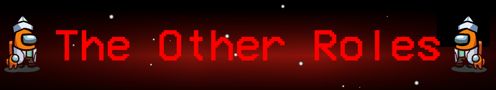
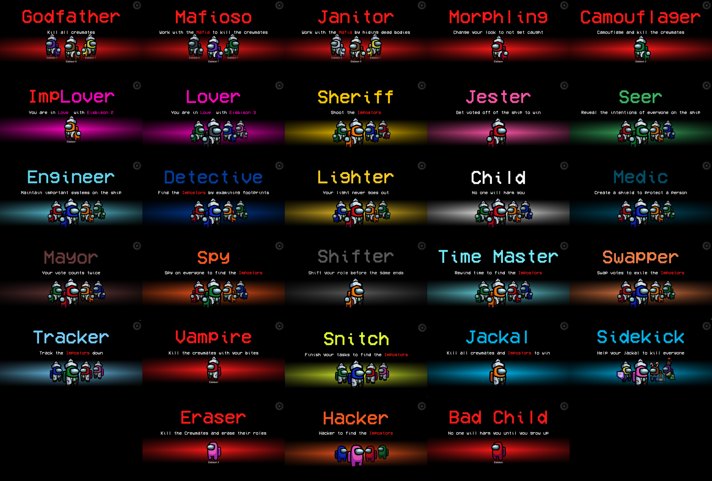

[](https://discord.gg/77RkMJHWsM)




# The Other Roles

The **The Other Roles**, is a mod for Amongs Us which adds manny new roles, new [Settings](#settings) and support for [10+ Player Lobbies](#Custom-Servers-and-10+-Players) to the game.
Even more roles are coming soon :)

- [Mafia](#mafia)
  - Godfather
  - Janitor
  - Mafioso
- [Morphling](#morphling)
- [Camouflager](#camouflager)
- [Vampire](#vampire)
- [Eraser](#eraser)
- [Trickster](#trickster)
- [Lovers](#lovers)
  - Lover
  - ImpLover
- [Sheriff](#sheriff)
- [Jester](#jester)
- [Seer](#seer)
- [Engineer](#engineer)
- [Detective](#detective)
- [Lighter](#lighter)
- [Child](#child)
  - Child Impostor
  - Child Crewmate
- [Medic](#medic)
- [Mayor](#mayor)
- [Hacker](#hacker)
- [Shifter](#shifter)
- [Time Master](#time-master)
- [Swapper](#swapper)
- [Tracker](#tracker)
- [Snitch](#snitch)
- [Jackal](#jackal)
- [Sidekick](#sidekick)
- [Spy](#spy)

The [Role Assignment](#role-assignment) sections explains how the roles are being distributed among the players.

# Releases
| Among Us - Version| Mod Version | Link |
|----------|-------------|-----------------|
| 2021.4.12s| v2.2.0| [Download](https://github.com/Eisbison/TheOtherRoles/releases/download/v2.2.0/TheOtherRoles.zip)
| 2021.3.31.3s| v2.1.0| [Download](https://github.com/Eisbison/TheOtherRoles/releases/download/v2.1.0/TheOtherRoles.zip)
| 2021.3.31.3s| v2.0.1 beta| [Download](https://github.com/Eisbison/TheOtherRoles/releases/download/v2.0.1/TheOtherRoles.zip)
| 2021.3.31.3s | v2.0.0 beta | [Download](https://github.com/Eisbison/TheOtherRoles/releases/download/v2.0.0/TheOtherRoles.zip)
| 2021.3.5s | v1.8.2 | [Download](https://github.com/Eisbison/TheOtherRoles/releases/download/v1.8.2/TheOtherRoles.zip)
| 2021.3.5s | v1.8.1 | [Download](https://github.com/Eisbison/TheOtherRoles/releases/download/v1.8.1/TheOtherRoles.zip)
| 2021.3.5s | v1.8 | [Download](https://github.com/Eisbison/TheOtherRoles/releases/download/v1.8/TheOtherRoles.zip)
| 2021.3.5s | v1.7 | [Download](https://github.com/Eisbison/TheOtherRoles/releases/download/v1.7/TheOtherRoles.zip)
| 2021.3.5s | v1.6 | [Download](https://github.com/Eisbison/TheOtherRoles/releases/download/v1.6/TheOtherRoles.zip)
| 2021.3.5s | v1.5 | [Download](https://github.com/Eisbison/TheOtherRoles/releases/download/v1.5/TheOtherRoles.zip)
| 2021.3.5s | v1.4 | [Download](https://github.com/Eisbison/TheOtherRoles/releases/download/v1.4/TheOtherRoles.zip)
| 2021.3.5s | v1.3 | [Download](https://github.com/Eisbison/TheOtherRoles/releases/download/v1.3/TheOtherRoles.zip)
| 2020.12.19s | v1.1 | [Download](https://github.com/Eisbison/TheOtherRoles/releases/download/v1.1/TheOtherRoles.zip)
| 2020.12.19s | v1.0 | [Download](https://github.com/Eisbison/TheOtherRoles/files/6097191/TheOtherRoles.zip)

# Changelog
<details>
  <summary>Click to show the Changelog</summary>

**Version 2.2.0**
- **Works with the latest Among Us version (2021.4.12s)**
- **Added support for 10+ player lobbies on custom servers:** Check the [Custom Servers and 10+ Players](#Custom-Servers-and-10+-Players) section. During meetings use the up/down keys, on vitals use the left/right keys.
- **Added a new Impostor role: The Trickster** check the [Trickster](#trickster) section for more infos
- You can now set how long the Time Master shield lasts
- The host now sees for how long the lobby will remain open
- We changed the look/layout of the settings
- Added a new option that deactivates skipping in meetings (if the player does not vote, he votes himself)
- You can now choose whether the Eraser is able to erase the Spy/Impostors or not
- Fixed a bug where a Lovers win wasn't displayed properly
- Fixed the Among Us bug where people were unable to move after meetings
- We added a version checking system: The host can only start the game if everyone in his lobby has the same version of the mod installed (he will see, who is using a wrong version). This prevents hacking in public lobbies and bugs because of version missmatches.
- Fixed a bug where the Child Impostor had the same cooldowns as normal Impostors
- Fixed a bug where the Vampire/Janitor/Mafioso would lose their kill button after being erased
- The Child is now able to use ladders and it can do all the tasks right away

**Version 2.1.0**
- **New Role:** [Spy](#spy)
- **Eraser:** The Eraser can now also remove the role of other Impostors. This enables him to reveal the Spy, but might result in removing the special ability of his partner.
- **Camouflager:** The Child age/size will now also be hidden, to allow the Child Impostor to kill during camouflage

**Hotfix 2.0.1**
- Fixed a bug where camouflaged players would get stuck on ladders/platforms on the airship
- Introduced a one second cooldown after the Morphling sampled another player
- The Child can now always reach all usables (ladders, tasks, ...)
- We removed a bug, where some footprints remained on the ground forever
- We removed a bug, where the Detective didn't see the right color type when reporting a player
- We changed the Jester win and Child lose conditions, they're not being affected by server delays anymore

**Changes in 2.0.0**
- **New button art** created by **Bavari**
- **New mod updater/installer tool** created by [Narua](https://github.com/Narua2010) and [Jolle](https://github.com/joelweih). Check the [Installation](#installation) section for more details.
- **Custom options:** Introduced customizable presets. Starting with 2.0.0, settings can be copied and used with higher versions (2.0.0).
- **Time Master rework:** Check [Time Master](#time-master) for more information
- **Medic:** The Medic report changed, it only shows the time since death (see Detective)
- **Detective:** The Detective now sees the name/color type of the killer when he reports a dead body (ability moved from the Medic to the Detective)
- **Lighter:** We changed and tried to nerf the Lighter, see the [Lighter](#lighter) section for more details.
- **Seer:** As the role didn't work the way it was, we completely changed it. We're still working on the role, for now we're trying a few things. Check the [Seer](#seer) section to get more details about the new Seer.
- **Shifter:** We reworked the Shifter, he is now part of the crew. Check out the [Shifter](#shifter) sections for more details.
- **Hacker:** The Hacker is basically the old Spy. We added the option to only show the color type instead of the color on the admin table.
- **Camouflager:** Now also overrides the information of other roles, check the [Camouflager](#camouflager) section for more details.
- **Morphling:** Now also overrides the information of other roles, check the [Morphling](#morphling) section for more details
- **Child:** The Child can now be a Crewmate Child or an Impostor Child, check the [Child](#child) section for more details
- **Eraser:** The Eraser, a new Impostor role, is now part of the mod. Check the [Eraser](#eraser) section for more details
- **New options:**
  - You can now set the maximum number of meetings in a game: Every player still only has one meeting. The Mayor can always use his meeting (even if the maximum number of meetings was reached). Impostor/Jackal meetings also count.

**Hotfix 1.8.2**
- Add map and impostor count to lobby settings.
- Fixed bugs where changing players to be the Sidekick didn't reset all the effects of their previous role. 

**Hotfix 1.8.1** Resolves bugs that occured when the Jackal recruited a Medic, Swapper and Tracker\
\
**Changes in v1.8:**
- **New Roles:** Added the Jackal and Sidekick roles
- Vampire: Medic report shows the right info now. A bitten Swapper is not able to swap if he dies at the beginning of a meeting. One can now set the cooldown and whether a normal kill is possible when a target is next to a garlic or not.
- Lover: New option that sets how often an ImpLover appears. If a Lover is exiled, his partner doesn't spawn a dead body anymore.
- Cooldowns now stop cooling down, if a player sits inside a vent.
- Fixed a bug that prevented the game from continuing after a meeting (for an edge case with Lovers)
- If two players try to kill each other at the same time both should die (e.g. Sheriff vs Impostor)
- We added a description for your current role right above the task list
- Added a description for the [Role Assignment System](#role-assignment)

\
**Changes in v1.7:**
- **New Roles:** The Vampire, the Tracker and the Snitch are now in the game
- The role assignment system has been changed
- Impostors now see a blue outline around all vents of the map, if the Engineer sits inside one of them

\
**Changes in v1.6:**
- This update is a small hotfix, fixing the bug where some people were unable to join lobbies.
- The child can't be voted out anymore before it turns 18, hence games can't end anymore because the child died. 
- Footprints are no longer visible to the Detective, if players are inside vents.

\
**Changes in v1.5:**
- Time Master - Buff: He is not affected by his rewind anymore, which gives him more utility. Players will now be rewinded out of vents.
- Child - Nerf: The child now grows up (see [child](#child)) and becomes a normal crewmate at some point. A growing child is not killable anymore. Some tasks are still not doable for the small child, we are working on that. But eventually when growing up it can do all the tasks as it's size increases.
- Seer - Nerf: Added an option that sets how often the Seer mistakes the player for another.
- Hacker - Nerf: The Hacker now only sees the additional information when he activates his "Hacker mode". That should stops the hacker from camping the admin table/vitals.
- Other: Camouflager/Morphling cooldowns were fixed. Custom regions code was removed to enable 3rd party tools. Some minor bugfixes.

**Changes in v1.4:**
- Fixing a Camoflager/Morphling animation bug
- Fixing a bug where the Swapper could swap votes even if they are dead
- The custom cooldown buttons now render the cooldown progress (the grey overlay) in the right way (v1.3 introduced the bug)
- Players in vents are not targetable anymore by the role actions, the button does not activate (e.g. Seer revealing, Morphling sample). Exception: Impostor killing an Engineer in a vent

**Changes in v1.3:**
- Adds support for the Among Us version **2021.3.5s**
- Fixes a bug where a an edge case caused all players to start the game with the camouflaged look
- There might be a few bugs, since I focused on getting the update out fast. A new version resolving the bugs will be published tomorrow.

**Changes in v1.1:**
- Morphling: The color of pet now also morphs. The skin animation now starts at the right point.
- The game over screen now shows if the Jester/Child/Lovers won.
- A bug was removed where the Jester won together with the crewmates.
- A bug was removed where the game of the Lovers crashed if they were the last players killed by the host of the lobby.
</details>

# Installation
## Windows Auto Installation/Updating Using The AmongUsModUpdater
This tool was made by [Narua](https://github.com/Narua2010) and [Jolle](https://github.com/joelweih). It automatically installs/updates the TheOtherRoles mod to the newest version, runs the game and
syncs your game options automatically.

1. Simply get the newest [release](https://github.com/Narua2010/AmongUsModUpdater/releases/latest) of the [AmongUsModUpdater](https://github.com/Narua2010/AmongUsModUpdater)
2. Unzip the folder and run the **setup.exe**

If you have problems with the AmongUsModUpdater, make sure To [contact us](https://discord.gg/csa3pHYdPU).

## Windows Manual Installation
1. Download and unzip the newest [release](https://github.com/Eisbison/TheOtherRoles/releases/latest)
2. Find the folder of your game, for steams players you can right click in steam, on the game, a menu will appear proposing you to go to the folders.
3. Make a copy of your game, it's not obligatory but advise, put it where you want.
4. Drag or extract the files from the zip into your game, at the .exe level.
5. Run the game (the first launch might take a while)

Not working? You might want to install the dependency [vc_redist](https://aka.ms/vs/16/release/vc_redist.x86.exe)


**Linux Manual**
1. Install Among Us via steam
2. Download newest [release](https://github.com/Eisbison/TheOtherRoles/releases/latest) and extract it to ~/.steam/steam/steamapps/common/Among Us
3. Enable winhttp.dll via the proton winecfg (https://bepinex.github.io/bepinex_docs/master/articles/advanced/steam_interop.html#protonwine)
4. Launch the game via Steam

# Custom Servers and 10+ Players
We always recommend you to play on custom servers rather than on the official ones. If you want to play with more than 10 players in one lobby, you're required to use a custom server. Credits for the original implementation that allowed 10+ player lobbies go to the creaters of the [Crowded-Mod](https://github.com/CrowdedMods/CrowdedMod).

**Setup the Clients:**
1. Run the game one time after you installed TheOtherRoles to generate the config files
2. Open the Among Us folder (or the folder containing the TheOtherRoles mod), go to the subfolder BepInEx/config/ and replace the *Custom Server IP* and *Custom Server Port* in the **me.eisbison.theotherroles.cfg** with the ones of your server
3. Launch the game and select the region *Custom*

**Setup the Server:**
1. Get the [Impostor](https://github.com/Impostor/Impostor) release for the Among Us version **2021.3.31 - 2021.4.2**
2. Follow the steps (using the server release you just downloaded) on the official [Impostor-Documentation](https://github.com/Impostor/Impostor/wiki/Running-the-server)
3. Make sure to set the following values to false in the *config.json* file:
```
    ...
    "AntiCheat": {
      "Enabled": false,
      "BanIpFromGame": false
    }
```
4. Make sure to forward the right ports on the hosting machine
5. Run the server and setup the client

**Setting up Server as Docker Container:** \
If you want to run the server as a docker container you'll need to use the image
```
aeonlucid/impostor:nightly
```
(Currently only the "nightly" tag is starting a server supporting 2021.3.31 or later)

In addition to running it we need to set the environment variables to disable the AntiCheat feature.
```
IMPOSTOR_AntiCheat__Enabled=false
IMPOSTOR_AntiCheat__BanIpFromGame=false
```

Example to docker run command:
```
docker run -p 22023:22023/udp --env IMPOSTOR_AntiCheat__Enabled=false --env IMPOSTOR_AntiCheat__BanIpFromGame=false aeonlucid/impostor:nightly
```

Or use to run it in the background
```
docker run -d -p 22023:22023/udp --env IMPOSTOR_AntiCheat__Enabled=false --env IMPOSTOR_AntiCheat__BanIpFromGame=false aeonlucid/impostor:nightly
```


# Credits & Resources
[Reactor](https://github.com/NuclearPowered/Reactor) - The framework used for all version before v2.0.0\
[BepInEx](https://github.com/BepInEx) - Used to hook game functions\
[Essentials](https://github.com/DorCoMaNdO/Reactor-Essentials) - Custom game options by **DorCoMaNdO**:
- Before v1.6: We used the default Essentials release
- v1.6-v1.8: We slightly changed the default Essentials. The changes can be found on this [branch](https://github.com/Eisbison/Reactor-Essentials/tree/feature/TheOtherRoles-Adaption) of our fork.
- v2.0.0 and later: As we're not using Reactor anymore, we are using our own implementation, inspired by the one from **DorCoMaNdO**

[Jackal and Sidekick](https://www.twitch.tv/dhalucard) - Original idea for the Jackal and Sidekick comes from **Dhalucard**\
[Among-Us-Love-Couple-Mod](https://github.com/Woodi-dev/Among-Us-Love-Couple-Mod) - Idea for the Lovers role comes from **Woodi-dev**\
[Jester](https://github.com/Maartii/Jester) - Idea for the Jester role comes from **Maartii**\
[ExtraRolesAmongUs](https://github.com/NotHunter101/ExtraRolesAmongUs) - Idea for the Engineer and Medic role comes from **NotHunter101**. Also some code snippets come of the implementation were used.\
[Among-Us-Sheriff-Mod](https://github.com/Woodi-dev/Among-Us-Sheriff-Mod) - Idea for the Sheriff role comes from **Woodi-dev**\
[TooManyRolesMods](https://github.com/Hardel-DW/TooManyRolesMods) - Idea for the Detective and Time Master roles comes from **Hardel-DW**. Also some code snippets of the implementation were used.\
[TownOfUs](https://github.com/slushiegoose/Town-Of-Us) - Idea for the Swapper, Shifter and a similar Mayor role come from **Slushiegoose**\
[Ottomated](https://twitter.com/ottomated_) - Idea for the Morphling, Snitch and Camouflager role come from **Ottomated**\
[Crowded-Mod](https://github.com/CrowdedMods/CrowdedMod) - Our implementation for 10+ player lobbies is inspired by the one from the **Crowded Mod Team**

# Settings
The mod adds a few new settings to Among Us (in addition to the role settings):
- **Number of Impostors:** The number of Impostor count be set inside a lobby
- **Map:** The map can be changed inside a lobby
- **Maximum Number Of Meetings:** You can set the maximum number of meetings that can be called in total (every player still has personal maximum of buttons, but if the maximum number of meetings is reached you can't use your meetings even if you have some left, Impostor and Jackal meetings also count) 
- **Allow Skips On Emergency Meetings:** If set to false, there will not be a skip button in emergency meetings. If a player does not vote, he'll vote himself.
# Roles

## Role Assignment
We are still improving the role assignment system. It's not that intuitive right now, but it's more flexible than the older one
if you're using it right.

First you need to choose how many special roles you want in the game (one option for Impostor roles and one option for the rest).
The count you set will only be reached, if there are enough Crewmates/Impostors in the game and if enough roles are set to be in the game (i.e. they are set to > 0%). The roles are then being distributed as follows:
- First all roles that are set to 100% are being assigned to arbitrary players
- After that each role that has 10%-90% selected adds 1-9 tickets to a ticket pool (one pool for Impostors, one for Crewmates). Then the roles will be selected randomly from that pool as long as possible (until the selected number is reached, until there are no more crewmates or until there are no more tickets). If a role is selected from the pool, obviously all the tickets of that role are being removed.

**Example:**\
Settings: 2 special crewmate roles, Snitch: 100%, Hacker: 10%, Tracker: 30%\
Result: Snitch is assigned, then one role out of the pool [Hacker, Tracker, Tracker, Tracker] is being selected\
Note: Changing the settings to Hacker: 20%, Tracker: 60% would statistically result in the same outcome .


## Mafia
### **Team: Impostors**
The Mafia are a group of three Impostors.\
The Godfather works like a normal Impostor.\
The Mafioso is an impostor who cannot kill nor sabotage until the Godfather is dead.\
The Janitor is an impostor who cannot kill nor sabotage, but they can hide dead bodies instead.\
\
**NOTE:**
- There have to be 3 impostors activated for the mafia to spawn.

### Game Options
| Name | Description |
|----------|:-------------:|
| Mafia Spawn Chance | -
| Janitor Cooldown | -
-----------------------

## Morphling
### **Team: Impostors**
The Morphling is an impostor which can additionally scan the appearance of a player. After an arbitrary time they can take on that appearance for 10s.
\
**NOTE:**
- They shrink to the size of the child when they copies its look.
- The Spy sees their new color on the admin table.
- The color of the footprints changes accordingly (also the ones that were already on the ground).
- The other impostor still sees that they are an impostor (the name remains red).
- The shield indicator changes accordingly (the Morphling gains or loses the shield indicator)
- Tracker and Snitch arrows keep working.

### Game Options
| Name | Description |
|----------|:-------------:|
| Morphling Spawn Chance | -
| Morphling Cooldown | -
-----------------------

## Camouflager
### **Team: Impostors**
The Camouflager is an impostor which can additionally activate a camouflage mode.
The camouflage mode lasts for 10s and while it is active, all player names/pets/hats
are hidden and all players have the same color.\
\
**NOTE**
- The Child will look like all the other players
- The color of the footprints turns gray (also the ones that were already on the ground).
- The Spy sees gray icons on the admin table
- The shield is not visible anymore
- Tracker and Snitch arrows keep working

### Game Options
| Name | Description |
|----------|:-------------:|
| Camouflager Spawn Chance | -
| Camouflager Cooldown | -
-----------------------

## Vampire
### **Team: Impostors**
The Vampire is an impostor, that can bite other player. Bitten players die after a configurable amount of time.\
If the Vampire spawn chance is greater 0 (even if there is no Vampire in the game), all players can place one garlic.\
If a victim is near a garlic, the "Bite Button" turns into the default "Kill Button" and the Vampire can only perform a normal kill.\
\
**NOTE:**
- If a bitten player is still alive when a meeting is being called, he dies at the start of the meeting.
- The cooldown is the same as the default kill cooldown (+ the kill delay if the Vampire bites the target).

### Game Options
| Name | Description |
|----------|:-------------:|
| Vampire Spawn Chance | -
| Vampire Kill Delay | -
| Vampire Cooldown | Sets the kill/bite cooldown
| Vampire Can Kill Near Garlics | The Vampire can never bite when his victim is near a garlic. If this option is set to true, he can still perform a normal kill there.
-----------------------

## Eraser
### **Team: Impostors**
The Eraser is an Impostor that can erase the role of every player.\
The targeted players will lose their role after the meeting right before a player is exiled.\
After every erase, the cooldown increases by 10 seconds.\
The erase will be performed, even if the Eraser or his target die before the next meeting.\
By default the Eraser can erase everyone but the Spy and other Impostors. Depending on the options
he can also erase them (Impostors will lose their special Impostor ability).
\
**NOTE:**
- The Shifter shift will always be triggered before the Erase (hence either the new role of the Shifter will be erased or the Shifter saves the role of his target, depending on who the Eraser erased)
- Erasing a Lover automatically erases the other Lover as well (if the second Lover is an ImpLover, he will turn into an Impostor)
- Erasing a Jackal that has a Sidekick, triggers the Sidekick promotion if it's activated in the settings
- As the erasing is being triggered before the eject of a player, erasing and voting out a Lover in the same round, would result in the
ex lover surviving as the partnership was erased before. Also a Jester win would not happen, as the erase will be triggered before.

### Game Options
| Name | Description |
|----------|:-------------:|
| Eraser Spawn Chance | -
| Eraser Cooldown | The Erasers cooldown will increase by 10 seconds after every erase.
| Eraser Can Erase Anyone | If set to false, he can't erase the Spy and other Impostors
-----------------------

## Trickster
### **Team: Impostors**
The Trickster is an Impostor that can place 3 jack-in-the-boxes that are invisible at first to other players. \
If the Trickster has placed all of his boxes they will be converted into a vent network usable only by the trickster himself, but the boxes are revealed to the others. \
If the boxes are converted to a vent network, the trickster gains a new ability "Lights out" to limit the visibility of Non-Impostors, that cannot be fixed by other players. Lights are automatically restored after a while. \

\
**NOTE:**
- Impostors will get a text indicator at the bottom of the screen to notify them if the lights are out due to the trickster ability, as there is no sabotage arrows or task to sabotage text to otherwise notify them about it.

### Game Options
| Name | Description |
|----------|:-------------:|
| Trickster Spawn Chance | -
| Trickster Box Cooldown | Cooldown for placing jack-in-the-boxes
| Trickster Lights Out Cooldown | Cooldown for his "lights out" ability
| Trickster Lights Out Duration | Duration after which the light is automatically restored
-----------------------

## Lovers
### **Team: Either Crewmates or Impostors**
There are always two lovers which are linked together.\
Their goal is it to stay alive together until the end of the game.\
If one Lover dies (and the option is activated), the other Lover suicides.\
You can specify the chance of one Lover being an impostor.\
The Lovers never know the role of their partner, they only see who their partner is.\
The Lovers win if they are both alive among the last 3 players, however they can also win with their respective role.\
If both Lovers are crewmates, they can achieve a "double victory" but the crewmates then also win.\
If one Lover is an impostor and one a crewmate, they can only get a "Lovers solo win" where only they win (even if there is another impostor alive).\
\
**NOTE:**
- If there is an equal amount of impostors and crewmates left in the game and one of the Lovers is an impostor, the game is not automatically over since the Lovers can still achieve a solo win. E.g. if there are the following roles Impostor + ImpLover + Lover + Crewmate left, the game will not end and the next kill will decide if the impostors or Lovers win.
- The Lovers can change if the Shifter takes the role of a Lovers

### Game Options
| Name | Description |
|----------|:-------------:|
| Lovers Spawn Chance | -
| Chance That One Lover Is Impostor | -
| Both Lovers Die | Whether the second Lover suicides, if the first one dies
-----------------------


## Sheriff
### **Team: Crewmates**
The Sheriff has the ability to kill impostors.
If they try to kill a crewmate, they die instead.

**NOTE**
- If the Sheriff shoots the person the Medic shielded, the Sheriff and the shielded person **both remain unharmed**.
- If the Sheriff shoots a Child Impostor, the Sheriff dies if the Child is still growing up. If it's 18, the Child Impostor dies.

### Game Options
| Name | Description |
|----------|:-------------:|
| Sheriff Spawn Chance | -
| Sheriff Cooldown | -
| Jester Can Die To Sheriff | -
-----------------------

## Jester
### **Team: Neutral**
The Jester does not have any tasks. They win the game as a solo, if they get voted out during a meeting.

### Game Options
| Name | Description |
|----------|:-------------:|
| Jester Spawn Chance | -
| Jester can call emergency meeting | Option to disable the emergency button for the Jester
-----------------------

## Seer
### **Team: Crewmates**
The Seer has two abilities (one can activate one of them or both in the options).
The Seer sees the souls of players that died a round earlier, the souls slowy fade away.
The Seer gets a blue flash on his screen, if a player dies somewhere on the map.

### Game Options
| Name | Description |
|----------|:-------------:|
| Seer Spawn Chance | - 
| Seer Mode | Options: Show death flash and souls, show death flash, show souls 
| Seer Limit Soul Duration | Toggle if souls should turn invisible after a while
| Seer Soul Duration | Sets how long it will take the souls to turn invisible after a meeting 
-----------------------

## Engineer
### **Team: Crewmates**
The Engineer (if alive) can fix one sabotage per game from anywhere on the map.\
The Engineer can use vents. If the Engineer is inside a vent, the impostors will see a blue outline
around all vents on the map (in order to warn them).
Because of the vents the Engineer might not be able to start some tasks using the "Use" button,
you can double click on the tasks instead.
\
**NOTE:**
- The kill button of Impostors activates if they stand next to a vent where the Engineer is. They can also kill them there. No other action (e.g. Morphling sample, Shifter shift, ...) can affect players inside vents.

### Game Options
| Name | Description |
|----------|:-------------:|
| Engineer Spawn Chance | -
-----------------------

## Detective
### **Team: Crewmates**
The Detective can see footprints that other players leave behind.
The Detective's other feature shows when they report a corpse: they recieve clues about the killer's identity. The type of information they get is based on the time it took them to find the corpse.
\
**NOTE**
- **Lighter Colors:** Pink, orange, yellow, white, cyan, lime
- **Darker Colors:** Red, blue, green, grey, purple, brown
- When people change their colors (because of a morph or camouflage), all the footprints also change their colors (also the ones that were already on the ground). If the effects are over, all footprints switch back to the original color.
- The detective does not see footprints of players that sit in vents

### Game Options
| Name | Description |
|----------|:-------------:|
| Detective Spawn Chance | -
| Anonymous Footprints | If set to true, all footprints will have the same color. Otherwise they will have the color of the respective player.
| Footprint Intervall | The intervall between two footprints
| Footprint Duration | Sets how long the footprints remain visible.
| Time Where Detective Reports Will Have Name | The amount of time that the Detective will have to report the body since death to get the killer's name.  |
| Time Where Detective Reports Will Have Color Type| The amount of time that the Detective will have to report the body since death to get the killer's color type. |
-----------------------

## Lighter
### **Team: Crewmates**
The Lighter can turn on his lighter every now and then, which increases his vision by a costumizable amount.

### Game Options
| Name | Description |
|----------|:-------------:|
| Lighter Spawn Chance | -
| Lighter Mode Vision On Lights On | The vision the Lighter has when the lights are on and the Lighter mode is on
| Lighter Mode Vision On Lights Off | The vision the Lighter has when the lights are down and the Lighter mode is on
| Lighter Cooldown | -
| Lighter Duration | -
-----------------------

## Child
### **Team: Crewmates or Impostors**
The Child can be a Crewmate (67% chance) or an Impostor (33% chance).\
The Child's character is smaller and hence visible to everyone in the game.\
The Child cannot be killed until it turns 18 years old, however it can be voted out.\
**Impostor Child:**
  - While growing up the kill cooldown is doubled. When it's fully grown up its kill cooldown is 2/3 of the default one.
  - If it gets thrown out of the ship, everything is fine.

**Crewmate Child:**
  - The Crewmate Child aims to play out the strength its invincibility in the early game.
  - If it gets thrown out of the ship before it turns 18, everyone loses. So think twice before you vote out a Child.

**NOTE:**
- Impostors can't kill the Child (the button does not work) until it turns 18
- The Sheriff can kill the Impostor Child, but only if it's fully grown up

### Game Options
| Name | Description |
|----------|:-------------:|
| Child Spawn Chance | -
| Child  | Child Growing Up Duration
-----------------------

## Medic
### **Team: Crewmates**
The Medic can shield (highlighted by an outline around the player) one player per game, which makes the player unkillable.\
The shielded player can still be voted out and might also be an impostor.\
If set in the options, the shielded player will get a red flash on their screen if someone (Impostor, Sheriff, ...) tried to murder them.
If the Medic dies, the shield disappears with them.\
The Sheriff will not die if they try to kill a shielded crewmate and won't perform a kill if they try to kill a shielded impostor.\
The Medic's other feature shows when they report a corpse: they will see how long ago the player died
\
**NOTE**
- If the shielded player is a Lover and the other Lover dies, they nevertheless kill themselves.
- If the Shifter has a shield or their target has a Shield, the shielded player switches.


### Game Options
| Name | Description | Options |
|----------|:-------------:|:-------------:|
| Medic Spawn Chance | - | -
| Show Shielded Player | Sets who sees if a player has a shield | "Everyone", "Shielded + Medic", "Medic"
| Shielded Player Sees Murder Attempt| Whether a shielded player sees if someone tries to kill him | True/false |
-----------------------

## Mayor
### **Team: Crewmates**
The Mayor leades the crewmates by having a vote that counts twice.\
The Mayor can always use his meeting, even if the maximum number of meetings was reached.

### Game Options
| Name | Description |
|----------|:-------------:|
| Mayor Spawn Chance | -
-----------------------

## Hacker
### **Team: Crewmates**
If the Hacker activates the "Hacker mode", the Hacker gets more information than others from the admin table and vitals for a set duration.\
Otherwise he sees the same information as everyone else.
**Admin table:** The hacker can see the colors (or color types) of the players on the table.\
**Vitals**: The hacker can see how long dead players have been dead for.\
\
**NOTE:**
- If the Morphling morphes or the Camouflager camouflages, the colors on the admin table change accordingly
- **Lighter Colors:** Pink, orange, yellow, white, cyan, lime
- **Darker Colors:** Red, blue, green, grey, purple, brown

### Game Options
| Name | Description |
|----------|:-------------:|
| Hacker Spawn Chance | -
| Hacker Cooldown| -
| Hacker Duration | Sets how long the "Hacker mode" remains active
| Hacker Only Sees Color Type | Sets if the Hacker sees the player colors on the admin table or only white/gray (for lighter and darker colors) 
-----------------------


## Shifter
### **Team: Crewmates**
The Shifter can take over the role of another Crewmate or Neutral, the other player will transform into a Crewmate.\
The Shift will always be performed at the end of the next meeting right before a player is exiled. The target needs to be chosen during the round.\
Even if the Shifter or the target dies before the meeting, the Shift will still be performed.\
Swapping roles with a Crewmate or Neutral gives them their role, the other player becomes a Crewmate.\
Swapping roles with an impostor or a custom impostor role fails and the Shifter commits suicide (there won't be a body after the meeting).\
The Shifter aims to save roles from leaving the game, by e.g. taking over a Sheriff or Medic that is known to the Impostors.\
This works especially well against the Eraser, but also gives the Eraser the possiblity to act like a Shifter.\
The **special interactions** with the Shifter are noted in the chapters of the respective roles.\
\
**NOTE:**
- The Shifter shift will always be triggered before the Erase (hence either the new role of the Shifter will be erased or the Shifter saves the role of his target, depending on who the Eraser erased)
- If the Shifter takes over a role, their new cooldowns will start at the maximum cooldown of the ability
- One time use abilities (e.g. shielding a player or engineer sabotage fix) can only used by one player in the game (i.e. the Shifter
can only use them, if the previous player did not used them before)

### Game Options
| Name | Description
|----------|:-------------:|
| Shifter Spawn Chance | -
-----------------------

## Time Master
### **Team: Crewmates**
The Time Master has a time shield which he can activate. The time shield remains active for a configurable amount of time.\
If a player trys to kill the Time Master while the time shield is active, the kill won't happen and the 
time will rewind for a set amount of time.\
The kill cooldown of the killer won't be reset, so the Time Master
has to make sure that the game won't result in the same situation.\
The Time Master won't be affected by the rewind.\
\
**NOTE:**
- Only the movement is affected by the rewind
- A Vampire bite will trigger the rewind. If the Time Master misses shielding the bite, he can still shield the kill which happens a few seconds later.
- If the Time Master was bitten and has his shield active before when a meeting is called, he survives but the time won't be rewinded.
- If the Time Master has a Medic shield, he won't rewind.
- The shield itself ends immediately when triggered. So the timemaster can be attacked again as soon as the rewind ends.

### Game Options
| Name | Description |
|----------|:-------------:|
| Time Master Spawn Chance | - |
| Time Master Cooldown | - |
| Rewind Duration | How much time to rewind |
| Time Master Shield Duration |
-----------------------

## Swapper
### **Team: Crewmates**
During meetings the Swapper can exchange votes that two people get (i.e. all votes
that player A got will be given to player B and vice versa).\
Because of the Swappers strength in meetings, they might not start emergency meetings
and can't fix lights and comms.

### Game Options
| Name | Description
|----------|:-------------:|
| Swapper Spawn Chance | -
| Swapper can call emergency meeting | Option to disable the emergency button for the Swapper
-----------------------

## Tracker
### **Team: Crewmates**
The Tracker can select one player in a game and tracks this player for the rest of the game.
An arrow points to the last tracked position of the player.
The arrow updates it's position every few seconds (configurable).

### Game Options
| Name | Description
|----------|:-------------:|
| Tracker Spawn Chance | -
| Tracker Update Intervall | Sets how often the position is being updated
-----------------------

## Snitch
### **Team: Crewmates**
When the Snitch finishes all the tasks, arrows will appear (only visible to the Snitch) that point to the impostors.
When the Snitch has one task left (configurable) the Snitch will be revealed to the impostors, also with an arrow.

### Game Options
| Name | Description
|----------|:-------------:|
| Snitch Spawn Chance | -
| Task Count Where Impostors See Snitch | -
-----------------------

## Jackal
### **Team: Jackal**
The Jackal is part of an extra team, that tries to eliminate all the other players.\
The Jackal has no tasks and can kill Impostors, Crewmates and Neutrals.\
The Jackal (if allowed by the options) can select another player to be his Sidekick.
Creating a Sidekick removes all tasks of the Sidekick and adds him to the team Jackal. The Sidekick loses his current role (except if he's a Lover, then he plays in two teams).
The "Create Sidekick Action" may only be used once per Jackal or once per game (depending on the options).
The Jackal can also promote Impostors to be his Sidekick, but depending on the options the Impostor will either really turn into the Sidekick and leave the team Impostors or he will just look like the Sidekick to the Jackal an remain as he was.\
\
The team Jackal enables multiple new outcomes of the game, listing some examples here:
- The Impostors could be eliminated and then the crew plays against the team Jackal.
- The Crew could be eliminated, then the Team Jackal fight against the Impostors (the Crew can still make a task win in this scenario)

The priority of the win conditions is the following:
1. Crewmate Child lose by vote
2. Jester wins by vote
3. Team Impostor wins by sabotage
4. Team Crew wins by tasks (also possible if the whole Crew is dead)
5. Lovers among the last three players win
6. Team Jackal wins by outnumbering (When the team Jackal contains an equal or greater amount of players than the Crew and there are 0 Impostors left and team Jackal contains no Lover)
7. Team Impostor wins by outnumbering (When the team Impostors contains an equal or greater amount of players than the Crew and there are 0 players of the team Jackal left and team Impostors contains no Lover)
8. Team Crew wins by outnumbering (When there is no player of the team Jackal and the team Impostrs left)

**NOTE:**
- The Jackal (and his Sidekick) may be killed by a Sheriff.
- A Jackal cannot target the Child, while it's growing up. After that he can kill it or select it as its Sidekick
- The Crew can still win, even if all of their members are dead, if they finish their tasks fast enough (that's why converting the last crewmate with tasks left into a Sidekick results in a task win for the crew)

If both impostors and jackals are in the game the game continues even if all crewmates are dead. Crewmates may still win in this case by completing their tasks. Jackal and Impostor have to kill each other.


### Game Options
| Name | Description
|----------|:-------------:|
| Jackal Spawn Chance | - |
| Jackal/Sidekick Kill Cooldown | Kill cooldown |
| Jackal Create Sidekick Cooldown | Cooldown before a sidekick can be created |
| Jackal can use vents | Yes/No |
| Jackal can create a sidekick | Yes/No |
| Jackals promoted from sidekick can create a sidekick | Yes/No (to prevent the jackal team from growing) |
| Jackals can make an impostor to his sidekick | Yes/No (to prevent a jackal from turning an impostor into a sidekick, if he uses the ability on an impostor he sees the impostor as sidekick, but the impostor isn't converted to sidekick. If this option is set to "No" Jackal and Sidekick can kill each other ) |
-----------------------

## Sidekick
### **Team: Jackal**
Gets assigned to a player during the game by the "Create Sidekick Action" of the Jackal and joins the Jackal in his quest to eliminate all other players.\
Upon the death of the Jackal (depending on the options), he might get promoted to Jackal himself and potentially even assign a Sidekick of his own.
\
**NOTE:**
- A player that converts into a Sidekick loses his previous role and tasks (if he had one), except the lover role.
- The Sidekick may be killed by a Sheriff.
- The Sidekick cannot target the Child, while it's growing up.

### Game Options
| Name | Description
|----------|:-------------:|
| Jackal/Sidekick Kill Cooldown | Uses the same kill cooldown setting as the Jackal |
| Sidekick gets promoted to Jackal on Jackal death |  Yes/No |
| Sidekick can kill | Yes/No |
| Sidekick can use vents | Yes/No |
-----------------------

## Spy
### **Team: Crewmates**
The Spy is a Crewmate, which has no special abilities.\
The Spy looks like an additional Impostor to the Impostors, they can't tell the difference.\
There are two possibilities (depending on the set options):
- The Impostors can't kill the Spy (because otherwise their kill button would reveal, who the Spy is)
- The Impostors can kill the Spy but they can also kill their Impostor partner (if they mistake another Impostor for the Spy)
You can set whether the Sheriff can kill the Spy or not (in order to keep the lie alive).

### Game Options
| Name | Description
|----------|:-------------:|
| Spy Spawn Chance |
| Spy Can Die To Sheriff | 
| Impostors Can Kill Anyone If There Is A Spy | This allows the Impostors to kill both the Spy and their Impostor partners
-----------------------


# Source code
It's bad I know, this is a side project and my second week of modding. So there are no best practices around here.
You can use parts of the codes but don't copy paste the whole thing. Make sure you give credits to the other developers, because some parts of the code are based on theirs.

# Bugs, suggestions and requests
If you found any bugs, have an idea for an idea for a new role or any other request, join my [Discord server](https://discord.gg/77RkMJHWsM)