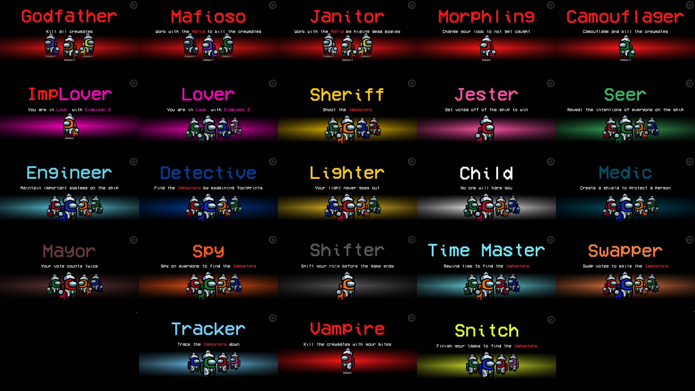

# The Other Roles

The **The Other Roles**, is a mod for Amongs Us which currently adds 20 additional roles to the game.
Even more roles are coming soon :)

- [Mafia](#mafia)
  - Godfather
  - Janitor
  - Mafioso
- [Morphling](#morphling)
- [Camouflager](#camouflager)
- [Vampire](#vampire)
- [Lovers](#lovers)
  - Lover
  - ImpLover
- [Sheriff](#sheriff)
- [Jester](#jester)
- [Seer](#seer)
- [Engineer](#engineer)
- [Detective](#detective)
- [Lighter](#lighter)
- [Child](#child)
- [Medic](#medic)
- [Mayor](#mayor)
- [Spy](#spy)
- [Shifter](#shifter)
- [Time Master](#time-master)
- [Swapper](#swapper)
- [Tracker](#tracker)
- [Snitch](#snitch)

# Releases :
| Among Us - Version| Mod Version | Link |
|----------|-------------|-----------------|
| 2021.3.5s | v1.7 | [Download](https://github.com/Eisbison/TheOtherRoles/releases/download/v1.7/TheOtherRoles.zip)
| 2021.3.5s | v1.6 | [Download](https://github.com/Eisbison/TheOtherRoles/releases/download/v1.6/TheOtherRoles.zip)
| 2021.3.5s | v1.5 | [Download](https://github.com/Eisbison/TheOtherRoles/releases/download/v1.5/TheOtherRoles.zip)
| 2021.3.5s | v1.4 | [Download](https://github.com/Eisbison/TheOtherRoles/releases/download/v1.4/TheOtherRoles.zip)
| 2021.3.5s | v1.3 | [Download](https://github.com/Eisbison/TheOtherRoles/releases/download/v1.3/TheOtherRoles.zip)
| 2020.12.19s | v1.1 | [Download](https://github.com/Eisbison/TheOtherRoles/releases/download/v1.1/TheOtherRoles.zip)
| 2020.12.19s | v1.0 | [Download](https://github.com/Eisbison/TheOtherRoles/files/6097191/TheOtherRoles.zip) |

\
**Changes in v1.7:**
- **New Roles:** The Vampire, the Tracker and the Snitch are now in the game
- The role assignment system has been changed
- Impostors now see a blue outline around all vents of the map, if the Engineer sits inside one of them

\
**Changes in v1.6:**
- This update is a small hotfix, fixing the bug where some people were unable to join lobbies.
- The child can't be voted out anymore before it turns 18, hence games can't end anymore because the child died. 
- Footprints are no longer visible to the Detective, if players are inside vents.

\
**Changes in v1.5:**
- Time Master - Buff: He is not affected by his rewind anymore, which gives him more utility. Players will now be rewinded out of vents.
- Child - Nerf: The child now grows up (see [child](#child)) and becomes a normal crewmate at some point. A growing child is not killable anymore. Some tasks are still not doable for the small child, we are working on that. But eventually when growing up it can do all the tasks as it's size increases.
- Seer - Nerf: Added an option that sets how often the Seer mistakes the player for another.
- Spy - Nerf: The Spy now only sees the additional information when he activates his "Spy mode". That should stops the spy from camping the admin table/vitals.
- Other: Camouflager/Morphling cooldowns were fixed. Custom regions code was removed to enable 3rd party tools. Some minor bugfixes.

**Changes in v1.4:**
- Fixing a Camoflager/Morphling animation bug
- Fixing a bug where the Swapper could swap votes even if they are dead
- The custom cooldown buttons now render the cooldown progress (the grey overlay) in the right way (v1.3 introduced the bug)
- Players in vents are not targetable anymore by the role actions, the button does not activate (e.g. Seer revealing, Morphling sample). Exception: Impostor killing an Engineer in a vent

**Changes in v1.3:**
- Adds support for the Among Us version **2021.3.5s**
- Fixes a bug where a an edge case caused all players to start the game with the camouflaged look
- There might be a few bugs, since I focused on getting the update out fast. A new version resolving the bugs will be published tomorrow.

**Changes in v1.1:**
- Morphling: The color of pet now also morphs. The skin animation now starts at the right point.
- The game over screen now shows if the Jester/Child/Lovers won.
- A bug was removed where the Jester won together with the crewmates.
- A bug was removed where the game of the Lovers crashed if they were the last players killed by the host of the lobby.

# Installation 
1. Download and unzip the newest [release](https://github.com/Eisbison/TheOtherRoles/releases/download/v1.7/TheOtherRoles.zip)
2. Find the folder of your game, for steams players you can right click in steam, on the game, a menu will appear proposing you to go to the folders.3. Make a copy of your game, it's not obligatory but advise, put it where you want.
4. Drag or extract the files from the zip into your game, at the .exe level.
6. Run the game (the first launch might take a while)

Not working? You might want to install the dependency [vc_redist](https://aka.ms/vs/16/release/vc_redist.x86.exe)

# Custom Servers
We recommend you to play on custom servers rather than on the official ones. A guide on how to set up a server will be added soon. In order to make your client able to connect to a custom server we recommend using [Unify](https://github.com/moltenmods/unify). Just add
the *.dll* file into your Among Us/BepInEx/plugins folder and you're good to go.

# Credits & Resources
[Reactor](https://github.com/NuclearPowered/Reactor) - The framework used\
[BepInEx](https://github.com/BepInEx) - Used to hook game functions\
[Essentials](https://github.com/DorCoMaNdO/Reactor-Essentials) - Custom game options by **DorCoMaNdO**\
[CooldownButton](https://github.com/DorCoMaNdO/Reactor-Essentials/blob/master/Essentials/UI/CooldownButton.cs) - Code for the cooldown button comes from **DorCoMaNdO**\
[Among-Us-Love-Couple-Mod](https://github.com/Woodi-dev/Among-Us-Love-Couple-Mod) - Idea for the Lovers role comes from **Woodi-dev**\
[Jester](https://github.com/Maartii/Jester) - Idea for the Jester role comes from **Maartii**\
[ExtraRolesAmongUs](https://github.com/NotHunter101/ExtraRolesAmongUs) - Idea for the Engineer and Medic role comes from **NotHunter101**. Also some code snippets come of the implementation were used.\
[Among-Us-Sheriff-Mod](https://github.com/Woodi-dev/Among-Us-Sheriff-Mod) - Idea for the Sheriff role comes from **Woodi-dev**\
[TooManyRolesMods](https://github.com/Hardel-DW/TooManyRolesMods) - Idea for the Detective and Time Master roles comes from **Hardel-DW**. Also some code snippets of the implementation were used.\
[TownOfUs](https://github.com/slushiegoose/Town-Of-Us) - Idea for the Swapper, Shifter and a similar Mayor role come from **Slushiegoose**\
[Ottomated](https://twitter.com/ottomated_) - Idea for the Morphling and Camouflager role come from **Ottomated**

# Roles

## Mafia
### **Team: Impostors**
The Mafia are a group of three Impostors.\
The Godfather works like a normal Impostor.\
The Mafioso is an impostor who cannot kill nor sabotage until the Godfather is dead.\
The Janitor is an impostor who cannot kill nor sabotage, but they can hide dead bodies instead.\
\
**NOTE**
- There have to be 3 impostors activated for the mafia to spawn.

### Game Options
| Name | Description |
|----------|:-------------:|
| Mafia Spawn Chance | -
| Janitor Cooldown | -
-----------------------

## Morphling
### **Team: Impostors**
The Morphling is an impostor which can additionally scan the appearance of a player. After an arbitrary time they can take on that appearance for 10s.
\
**NOTE**
- They shrink to the size of the child when they copies its look.
- The color of the footprints does **not** change.
- The Seer still sees the Morphlings role if they revealed it.
- The other impostor still sees that they are an impostor (the name remains red).

### Game Options
| Name | Description |
|----------|:-------------:|
| Morphling Spawn Chance | -
| Morphling Cooldown | -
-----------------------

## Camouflager
### **Team: Impostors**
The Camouflager is an impostor which can additionally activate a camouflage mode.
The camouflage mode lasts for 10s and while it is active, all player names/pets/hats
are hidden and all players have the same color.
\
**NOTE**
- The Child and Morphling when copying the child remain small.
- The color of the footprints does **not** change.
- The Seer still sees all the roles they revealed.

### Game Options
| Name | Description |
|----------|:-------------:|
| Camouflager Spawn Chance | -
| Camouflager Cooldown | -
-----------------------

## Vampire
### **Team: Impostors**
The Vampire is an impostor, that can bite other player. Bitten players die after a configurable amount of time.\
If the Vampire spawn chance is greater 0 (even if there is no Vampire in the game), all players can place one garlic.\
If a victim is near a garlic, the "Bite Button" turns into the default "Kill Button" and the Vampire can only perform a normal kill.
\
**NOTE**
- If a bitten player is still alive when a meeting is being called, he dies at the start of the meeting.
- The cooldown is the same as the default kill cooldown (+ the kill delay if the Vampire bites the target).

### Game Options
| Name | Description |
|----------|:-------------:|
| Vampire Spawn Chance | -
| Vampire Kill Delay | -
-----------------------

## Lovers
### **Team: Either Crewmates or Impostors**
There are always two lovers which are linked together.\
Their goal is it to stay alive together until the end of the game.\
If one Lover dies (and the option is activated), the other Lover suicides.\
There is a 67% chance that both Lovers are crewmates and a 33% chance that one of them is an impostor (ImpLover) and one a crewmate. In both cases they don't see the role of the other player, they only see that they are a Lover\
The Lovers win if they are both alive among the last 3 players, however they can also win with their respective role.\
If both Lovers are crewmates, they can achieve a "double victory" but the crewmates then also win.\
If one Lover is an impostor and one a crewmate, they can get a "Lovers solo win" where only they win (even if there is another impostor alive).
\
**NOTE**
- If there is an equal amount of impostors and crewmates left in the game and one of the Lovers is an impostor, the game is not automatically over since the Lovers can still achieve a solo win. E.g. if there are the following roles Impostor + ImpLover + Lover + Crewmate left, the game will not end and the next kill will decide if the impostors or Lovers win.
- The Lovers can change if the Shifter exchanges role with one of the Lovers

### Game Options
| Name | Description |
|----------|:-------------:|
| Lovers Spawn Chance | -
| Both Lovers Die | Whether the second Lover suicides, if the first one dies
-----------------------

## Sheriff
### **Team: Crewmates**
The Sheriff has the ability to kill impostors.
If they try to kill a crewmate, they die instead.

**NOTE**
- For now the Shifter won't die to the Sheriff (an option will be added in the next version).
- If the Sheriff shoots the person the Medic shielded, the Sheriff and the shielded person **both remain unharmed**.

### Game Options
| Name | Description |
|----------|:-------------:|
| Sheriff Spawn Chance | -
| Sheriff Cooldown | -
| Jester Can Die To Sheriff | -
-----------------------

## Jester
### **Team: Neutral**
The Jester does not have any tasks. They win the game as a solo, if they get voted out during a meeting.

### Game Options
| Name | Description |
|----------|:-------------:|
| Jester Spawn Chance | -
-----------------------

## Seer
### **Team: Crewmates**
The Seer has the ability to find out about people's intentions. The information is only visible to them.\
Depending on the selected option they either directly see the role of the player (appended to their name) or if the player is 
a good (name text changes to yellow) or a bad (name text changes to a darker color) player.\
Depending on the selected option the player will get a blue flash on their screen if they are being revealed by the Seer.
The Seer can make mistakes (how many depends on the selected option). If a mistake happens, the information of another player (not the target, not the Seer) gets revealed.

\
**NOTE**
- **Good players:** Crewmates with all their special roles
- **Bad players:** Impostors with all their special roles (Mafia, Morphling, Camouflager, ImpLover) and the neutral roles (Jester, Shifter)
- **Cooldown:** The cooldown of the Seer wil **not** be reset after a meeting (in order to balance the option to reveal roles)
- If the role of a revealed player changes during the game (because of e.g. the Shifter), the information of the Seers also adapts.
- When the Camouflager camouflages all players or the Morphling copies the appearance of another player, the Seer still sees the information they gained earlier (i.e. they still see that the player is the Morphling even if their appearance is different).
- If the Shifter exchanges the role with the Seer, the information gained by the Seer will be transfered to the new Seer (i.e. the new Seer sees what the old one revealed and the old one "loses" the information they gained).

### Game Options
| Name | Description | Options |
|----------|:-------------:|:-------------:|
| Seer Spawn Chance | - | -
| Seer Cooldown | Cooldown for his special ability. This cooldown will **not** be reset after a meeting | -
| Seer Chance Of Seeing Right | Sets the chance of how likely the Seer makes a mistake | -
| Info That Seer Reveals | Description above | "Role", "Good/Bad"
| Players That See When They Are Being Revealed | Selects the group of players that get notified when they are being revealed | "Everyone", "The Good", "The Bad", "Nobody"
-----------------------

## Engineer
### **Team: Crewmates**
The Engineer (if alive) can fix one sabotage per game from anywhere on the map.\
The Engineer can use vents. If the Engineer is inside a vent, the impostors will see a blue outline
around all vents on the map (in order to warn them).
Because of the vents the Engineer might not be able to start some tasks using the "Use" button,
you can double click on the tasks instead.
\
**NOTE**
- The kill button of Impostors activates if they stand next to a vent where the Engineer is. They can also kill them there. No other action (e.g. Morphling sample, Shifter shift, ...) can affect players inside vents.

### Game Options
| Name | Description |
|----------|:-------------:|
| Engineer Spawn Chance | -
-----------------------

## Detective
### **Team: Crewmates**
The Detective can see footprints that other players leave behind.
\
**NOTE**
- Even when the Morphling changes their appearance or the Camouflager camouflages everyone, the
Detective still sees the right (original) colors.
- The detective does not see footprints of players that sit in vents

### Game Options
| Name | Description |
|----------|:-------------:|
| Detective Spawn Chance | -
| Anonymous Footprints | If set to true, all footprints will have the same color. Otherwise they will have the color of the respective player.
| Footprint Intervall | The intervall between two footprints
| Footprint Duration | Sets how long the footprints remain visible.
-----------------------

## Lighter
### **Team: Crewmates**
The vision of the Lighter never changes, even if the lights are out.\
Depending on the options the Lighter can have a bigger or smaller vision than other crewmates.

### Game Options
| Name | Description |
|----------|:-------------:|
| Lighter Spawn Chance | -
| Lighter Vision | -
-----------------------

## Child
### **Team: Crewmates**
The Child won't be harmed by anyone until it turns 18 years old, then it becomes a regular crewmate.\
The Child's character is smaller and hence visible to everyone in the game.\
The child works with the crewmates and aims to play out the strength of its "invincibility" in the early game.\
If the child is voted out before it turns 18, everyone in the lobby loses.
\
**NOTE**
- Impostors can't kill the child (the button does not work) until it turns 18
- The Sheriff always suicides if he tries to kill the child

### Game Options
| Name | Description |
|----------|:-------------:|
| Child Spawn Chance | -
| Child  | Child Growing Up Duration
-----------------------

## Medic
### **Team: Crewmates**
The Medic can shield (highlighted by an outline around the player) one player per game, which makes the player unkillable.\
The shielded player can still be voted out and might also be an impostor.\
If set in the options, the shielded player will get a red flash on their screen if someone (Impostor, Sheriff, ...) tried to murder them.
If the Medic dies, the shield disappears with them.\
The Sheriff will not die if they try to kill a shielded crewmate and won't perform a kill if they try to kill a shielded impostor.\
The Medic's other feature shows when they report a corpse: they recieve clues about the killer's identity. The type of information they get is based on the time it took them to find the corpse.
\
**NOTE**
- **Lighter Colors:** Pink, orange, yellow, white, cyan, lime
- **Darker Colors:** Red, blue, green, grey, purple, brown
- If the shielded player is a Lover and the other Lover dies, they nevertheless kill themselves.
- If the Shifter has a shield or their target has a Shield, the shielded player switches.

### Game Options
| Name | Description | Options |
|----------|:-------------:|:-------------:|
| Medic Spawn Chance | - | -
| Show Shielded Player | Sets who sees if a player has a shield | "Everyone", "Shielded + Medic", "Medic"
| Time Where Medic Reports Will Have Name | The amount of time that the Medic will have to report the body since death to get the killer's name.  |
| Time Where Medic Reports Will Have Color Type| The amount of time that the Medic will have to report the body since death to get the killer's color type. |
|Shielded Player Sees Murder Attempt| Whether a shielded player sees if someone tries to kill him | True/false |
-----------------------

## Mayor
### **Team: Crewmates**
The Mayor leades the crewmates by having a vote that counts twice.

### Game Options
| Name | Description |
|----------|:-------------:|
| Mayor Spawn Chance | -
-----------------------

## Spy
### **Team: Crewmates**
If the Spy activates the "Spy mode", the Spy gets more information than others from the admin table and vitals for a set duration.\
Otherwise he sees the same information as everyone else.
**Admin table:** The spy can see the colors of the players on the table.\
**Vitals**: The spy can see how long dead players have been dead for.\
\
**NOTE:**
- Even if the Morphling morphes or the Camouflager camouflages, the Spy sees the right colors on the admin table.
### Game Options
| Name | Description |
|----------|:-------------:|
| Spy Spawn Chance | -
| Spy Cooldown| -
| Spy Duration | Sets how long the "Spy mode" remains active
-----------------------

## Shifter
### **Team: Neutral**
The Shifter belongs to no team and has no tasks.\
The Shifter always loses the game, however they can exchange roles with other players.\
Swapping roles with a crewmate or a custom crewmate role (or the Jester) gives them their role and their tasks, the other player becomes the new Shifter.\
Swapping roles with an impostor or a custom impostor role fails and the Shifter commits suicide.\
The **special interactions** with the Shifter are noted in the chapters of the respective roles.\
\
**NOTE:**
- If the Shifter takes over a role, their new cooldowns will start at the maximum cooldown of the ability
- One time use abilities (e.g. shielding a player or engineer sabotage fix) can only used by one player in the game (i.e. the Shifter
can only use them, if the player they exchanged roles with have not used them before)

### Game Options
| Name | Description
|----------|:-------------:|
| Shifter Spawn Chance | -
| Shifter Cooldown | -
-----------------------

## Time Master
### **Team: Crewmates**
The Time Master can rewind the time. The Time Master won't be affected by the rewind.\
If set in the options, players will be revived during the time rewind.\
Only movement and kills are affected (not cooldowns, meetings, tasks, ...)

### Game Options
| Name | Description |
|----------|:-------------:|
| Time Master Spawn Chance | - |
| Time Master Cooldown | - |
| Rewind Duration | How much time to rewind |
| Revive During Rewind | Whether to revive dead players when rewinding |
-----------------------

## Swapper
### **Team: Crewmates**
During meetings the Swapper can exchange votes that two people get (i.e. all votes
that player A got will be given to player B and vice versa).\
Because of the Swappers strength in meetings, they can't start emergency meetings
and can't fix lights and comms.

### Game Options
| Name | Description
|----------|:-------------:|
| Swapper Spawn Chance | -
-----------------------

## Tracker
### **Team: Crewmates**
The Tracker can select one player in a game and tracks this player for the rest of the game.
An arrow points to the last tracked position of the player.
The arrow updates it's position every few seconds (configurable).

### Game Options
| Name | Description
|----------|:-------------:|
| Tracker Spawn Chance | -
| Tracker Update Intervall | Sets how often the position is being updated
-----------------------

## Snitch
### **Team: Crewmates**
When the Snitch finshes all the tasks, arrows will appear (only visible to the Snitch) that point to the impostors.
When the Snitch has one task left (configurable) the Snitch will be revealed to the impostors, also with an arrow.

### Game Options
| Name | Description
|----------|:-------------:|
| Snitch Spawn Chance | -
| Task Count Where Impostors See Snitch | -
-----------------------

# Source code
It's bad I know, this is a side project and my second week of modding. So there are no best practices around here.
You can use parts of the codes but don't copy paste the whole thing. Make sure you give credits to the other developers, because some parts of the code are base on theirs. And yes it is in a zip file... I will change that.

# Bugs, suggestions and requests
If you found any bugs, have an idea for an idea for a new role or any other request, join my [Discord server](https://discord.gg/77RkMJHWsM)