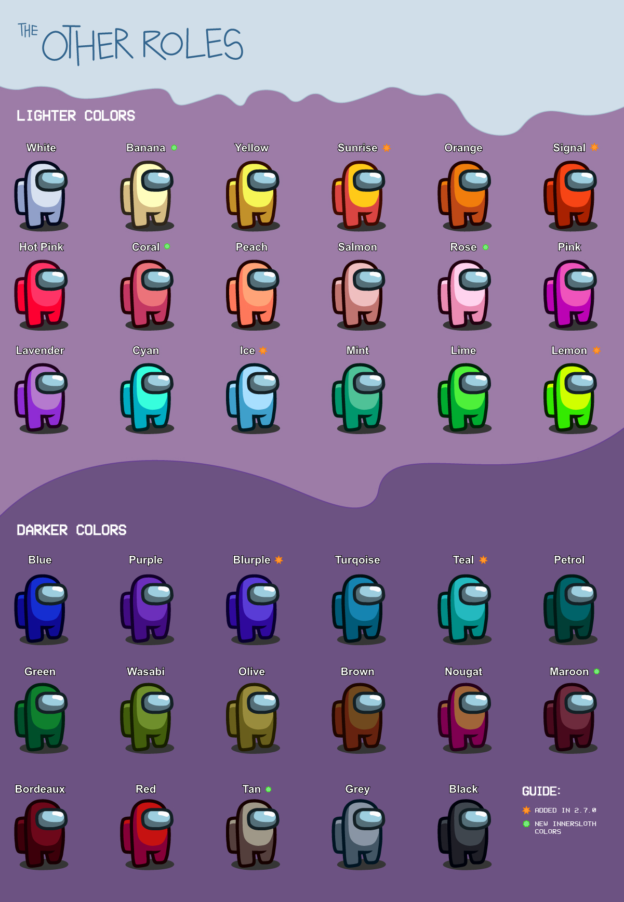

<p align="center"><a href="https://github.com/Eisbison/TheOtherRoles/releases/"></a></p>


This mod is not affiliated with Among Us or Innersloth LLC, and the content contained therein is not endorsed or otherwise sponsored by Innersloth LLC. Portions of the materials contained herein are property of Innersloth LLC. © Innersloth LLC.</p>
<p align="center">
  To other mod devs: for usage of our code, please read and respect the <a href="#license">license</a></p>

[](https://discord.gg/77RkMJHWsM)


# The Other Roles

The **The Other Roles** is a mod for [Among Us](https://store.steampowered.com/app/945360/Among_Us) which adds many new roles, new [Settings](#settings) and new [Custom Hats](#custom-hats) to the game.
Even more roles are coming soon. :)

| Impostor | Crewmate | Neutral | Modifier | Gamemode |
|----------|-------------|-----------------|----------------|----------------|
| [Godfather (Mafia)](#mafia) | [Mayor](#mayor) | [Jester](#jester) | [Bloody](#bloody) | [Classic](#roles) |
| [Mafioso (Mafia)](#mafia) | [Engineer](#engineer) | [Arsonist](#arsonist) | [Anti Teleport](#anti-teleport) | [Guesser Modifier](#guesser-modifier) |
| [Janitor (Mafia)](#mafia) | [Sheriff](#sheriff) | [Jackal](#jackal) | [Tie Breaker](#tie-breaker) | [Hide 'n' Seek](#hide-n-seek) |
| [Morphling](#morphling) | [Deputy](#deputy) | [Sidekick](#sidekick) | [Bait](#bait) | [Vanilla Hide 'n' Seek](https://www.innersloth.com/new-game-mode-hide-n-seek-is-here-emergency-meeting-35/) |
| [Camouflager](#camouflager) | [Lighter](#lighter) | [Vulture](#vulture) | [Lovers](#lovers) | [PropHunt](#prophunt)|
| [Vampire](#vampire) | [Detective](#detective) | [Lawyer](#lawyer) | [Sunglasses](#sunglasses) |
| [Eraser](#eraser) | [Time Master](#time-master) | [Prosecutor](#prosecutor) | [Mini](#mini) |
| [Trickster](#trickster) | [Medic](#medic) | [Pursuer](#pursuer) | [VIP](#vip) |
| [Cleaner](#cleaner) | [Swapper](#swapper) | [Thief](#thief) | [Invert](#invert) |
| [Warlock](#warlock) | [Seer](#seer) |  | [Chameleon](#chameleon) |
| [Bounty Hunter](#bounty-hunter) | [Hacker](#hacker) |  | [Shifter](#shifter)
| [Witch](#witch) | [Tracker](#tracker) |  |  |
| [Ninja](#ninja) | [Snitch](#snitch) |  |  |
| [Bomber](#bomber) | [Spy](#spy) |  |  |
| [Evil Guesser](#guesser) | [Portalmaker](#portalmaker) |  |  |
|  | [Security Guard](#security-guard) |  |  |
|  | [Medium](#medium) |  |  |
|  | [Trapper](#trapper) |  |  |
|  | [Nice Guesser](#guesser) |  |  |

The [Role Assignment](#role-assignment) section explains how the roles are being distributed among the players.

# Releases
| Among Us - Version| Mod Version | Link |
|----------|-------------|-----------------|
| 2024.3.5s| v4.5.2| [Download](https://github.com/TheOtherRolesAU/TheOtherRoles/releases/download/v4.5.2/TheOtherRoles.zip)
| 2023.11.28s| v4.5.1| [Download](https://github.com/TheOtherRolesAU/TheOtherRoles/releases/download/v4.5.1/TheOtherRoles.zip)

<details>
  <summary>Click to show older versions</summary>
  
| Among Us - Version| Mod Version | Link |
|----------|-------------|-----------------|
| 2023.11.28s| v4.5.0| [Download](https://github.com/TheOtherRolesAU/TheOtherRoles/releases/download/v4.5.0/TheOtherRoles.zip)
| 2023.07.12s| v4.4.2| [Download](https://github.com/TheOtherRolesAU/TheOtherRoles/releases/download/v4.4.2/TheOtherRoles.zip)
| 2023.07.12s| v4.4.1| [Download](https://github.com/TheOtherRolesAU/TheOtherRoles/releases/download/v4.4.1/TheOtherRoles.zip)
| 2023.07.12s| v4.4.0| [Download](https://github.com/TheOtherRolesAU/TheOtherRoles/releases/download/v4.4.0/TheOtherRoles.zip)
| 2023.07.12s| v4.3.4| [Download](https://github.com/Eisbison/TheOtherRoles/releases/download/v4.3.4/TheOtherRoles.zip)
| 2023.07.12s| v4.3.3| [Download](https://github.com/Eisbison/TheOtherRoles/releases/download/v4.3.3/TheOtherRoles.zip)
| 2023.03.28s| v4.3.2| [Download](https://github.com/Eisbison/TheOtherRoles/releases/download/v4.3.2/TheOtherRoles.zip)
| 2023.03.28s| v4.3.1| [Download](https://github.com/Eisbison/TheOtherRoles/releases/download/v4.3.1/TheOtherRoles.zip)
| 2023.02.28s| v4.3.0| [Download](https://github.com/Eisbison/TheOtherRoles/releases/download/v4.3.0/TheOtherRoles.zip)
| 2022.12.14s| v4.2.1| [Download](https://github.com/Eisbison/TheOtherRoles/releases/download/v4.2.1/TheOtherRoles.zip)
| 2022.10.25s| v4.2.0| [Download](https://github.com/Eisbison/TheOtherRoles/releases/download/v4.2.0/TheOtherRoles.zip)
| 2022.9.20s| v4.1.7| [Download](https://github.com/Eisbison/TheOtherRoles/releases/download/v4.1.7/TheOtherRoles.zip)
| 2022.6.21s| v4.1.6| [Download](https://github.com/Eisbison/TheOtherRoles/releases/download/v4.1.6/TheOtherRoles.zip)
| 2022.6.21s| v4.1.5| [Download](https://github.com/Eisbison/TheOtherRoles/releases/download/v4.1.5/TheOtherRoles.zip)
| 2022.3.29s| v4.1.4| [Download](https://github.com/Eisbison/TheOtherRoles/releases/download/v4.1.4/TheOtherRoles.zip)
| 2022.3.29s| v4.1.3| [Download](https://github.com/Eisbison/TheOtherRoles/releases/download/v4.1.3/TheOtherRoles.zip)
| 2022.3.29s| v4.1.2| [Download](https://github.com/Eisbison/TheOtherRoles/releases/download/v4.1.2/TheOtherRoles.zip)
| 2022.3.29s| v4.1.1| [Download](https://github.com/Eisbison/TheOtherRoles/releases/download/v4.1.1/TheOtherRoles.zip)
| 2022.3.29s| v4.1.0| [Download](https://github.com/Eisbison/TheOtherRoles/releases/download/v4.1.0/TheOtherRoles.zip)
| 2022.3.29s| v4.0.0| [Download](https://github.com/Eisbison/TheOtherRoles/releases/download/v4.0.0/TheOtherRoles.zip)
| 2022.3.29s| v3.4.5| [Download](https://github.com/Eisbison/TheOtherRoles/releases/download/v3.4.5/TheOtherRoles.zip)
| 2022.2.23s| v3.4.4| [Download](https://github.com/Eisbison/TheOtherRoles/releases/download/v3.4.4/TheOtherRoles.zip)
| 2021.12.15s| v3.4.3| [Download](https://github.com/Eisbison/TheOtherRoles/releases/download/v3.4.3/TheOtherRoles.zip)
| 2021.12.15s| v3.4.2| [Download](https://github.com/Eisbison/TheOtherRoles/releases/download/v3.4.2/TheOtherRoles.zip)
| 2021.12.15s| v3.4.1| [Download](https://github.com/Eisbison/TheOtherRoles/releases/download/v3.4.1/TheOtherRoles.zip)
| 2021.12.15s| v3.4.0| [Download](https://github.com/Eisbison/TheOtherRoles/releases/download/v3.4.0/TheOtherRoles.zip)
| 2021.12.15s| v3.3.3| [Download](https://github.com/Eisbison/TheOtherRoles/releases/download/v3.3.3/TheOtherRoles.zip)
| 2021.12.15s| v3.3.2| [Download](https://github.com/Eisbison/TheOtherRoles/releases/download/v3.3.2/TheOtherRoles.zip)
| 2021.12.14s| v3.3.1| [Download](https://github.com/Eisbison/TheOtherRoles/releases/download/v3.3.1/TheOtherRoles.zip)
| 2021.12.14s| v3.3.0| [Download](https://github.com/Eisbison/TheOtherRoles/releases/download/v3.3.0/TheOtherRoles.zip)
| 2021.11.9.5s| v3.2.4| [Download](https://github.com/Eisbison/TheOtherRoles/releases/download/v3.2.4/TheOtherRoles.zip)
| 2021.11.9.5s| v3.2.3| [Download](https://github.com/Eisbison/TheOtherRoles/releases/download/v3.2.3/TheOtherRoles.zip)
| 2021.11.9.5s| v3.2.2| [Download](https://github.com/Eisbison/TheOtherRoles/releases/download/v3.2.2/TheOtherRoles.zip)
| 2021.11.9.5s| v3.2.1| [Download](https://github.com/Eisbison/TheOtherRoles/releases/download/v3.2.1/TheOtherRoles.zip)
| 2021.11.9.5s| v3.2.0| [Download](https://github.com/Eisbison/TheOtherRoles/releases/download/v3.2.0/TheOtherRoles.zip)
| 2021.11.9.5s| v3.1.2| [Download](https://github.com/Eisbison/TheOtherRoles/releases/download/v3.1.2/TheOtherRoles.zip)
| 2021.11.9.5s| v3.1.1| [Download](https://github.com/Eisbison/TheOtherRoles/releases/download/v3.1.1/TheOtherRoles.zip)
| 2021.11.9.5s| v3.1.0| [Download](https://github.com/Eisbison/TheOtherRoles/releases/download/v3.1.0/TheOtherRoles.zip)
| 2021.11.9.5s| v3.0.0| [Download](https://github.com/Eisbison/TheOtherRoles/releases/download/v3.0.0/TheOtherRoles.zip)
| 2021.6.30s| v2.9.2| [Download](https://github.com/Eisbison/TheOtherRoles/releases/download/v2.9.2/TheOtherRoles.zip)
| 2021.6.30s| v2.9.1| [Download](https://github.com/Eisbison/TheOtherRoles/releases/download/v2.9.1/TheOtherRoles.zip)
| 2021.6.30s| v2.9.0| [Download](https://github.com/Eisbison/TheOtherRoles/releases/download/v2.9.0/TheOtherRoles.zip)
| 2021.6.30s| v2.8.1| [Download](https://github.com/Eisbison/TheOtherRoles/releases/download/v2.8.1/TheOtherRoles.zip)
| 2021.6.30s| v2.8.0| [Download](https://github.com/Eisbison/TheOtherRoles/releases/download/v2.8.0/TheOtherRoles.zip)
| 2021.6.30s| v2.7.3| [Download](https://github.com/Eisbison/TheOtherRoles/releases/download/v2.7.3/TheOtherRoles.zip)
| 2021.6.15s| v2.7.1| [Download](https://github.com/Eisbison/TheOtherRoles/releases/download/v2.7.1/TheOtherRoles.zip)
| 2021.6.15s| v2.7.0| [Download](https://github.com/Eisbison/TheOtherRoles/releases/download/v2.7.0/TheOtherRoles.zip)
| 2021.5.25.2s| v2.6.7| [Download](https://github.com/Eisbison/TheOtherRoles/releases/download/v2.6.7/TheOtherRoles.zip)
| 2021.5.10s| v2.6.6| [Download](https://github.com/Eisbison/TheOtherRoles/releases/download/v2.6.6/TheOtherRoles.zip)
| 2021.5.10s| v2.6.5| [Download](https://github.com/Eisbison/TheOtherRoles/releases/download/v2.6.5/TheOtherRoles.zip)
| 2021.5.10s| v2.6.4| [Download](https://github.com/Eisbison/TheOtherRoles/releases/download/v2.6.4/TheOtherRoles.zip)
| 2021.5.10s| v2.6.3| [Download](https://github.com/Eisbison/TheOtherRoles/releases/download/v2.6.3/TheOtherRoles.zip)
| 2021.5.10s| v2.6.2| [Download](https://github.com/Eisbison/TheOtherRoles/releases/download/v2.6.2/TheOtherRoles.zip)
| 2021.4.14s| v2.6.1| [Download](https://github.com/Eisbison/TheOtherRoles/releases/download/v2.6.1/TheOtherRoles.zip)
| 2021.4.14s| v2.6.0| [Download](https://github.com/Eisbison/TheOtherRoles/releases/download/v2.6.0/TheOtherRoles.zip)
| 2021.4.14s| v2.5.1| [Download](https://github.com/Eisbison/TheOtherRoles/releases/download/v2.5.1/TheOtherRoles.zip)
| 2021.4.14s| v2.5.0| [Download](https://github.com/Eisbison/TheOtherRoles/releases/download/v2.5.0/TheOtherRoles.zip)
| 2021.4.14s| v2.4.0| [Download](https://github.com/Eisbison/TheOtherRoles/releases/download/v2.4.0/TheOtherRoles.zip)
| 2021.4.14s| v2.3.0| [Download](https://github.com/Eisbison/TheOtherRoles/releases/download/v2.3.0/TheOtherRoles.zip)
| 2021.4.14s| v2.2.2| [Download](https://github.com/Eisbison/TheOtherRoles/releases/download/v2.2.2/TheOtherRoles.zip)
| 2021.4.12s| v2.2.1| [Download](https://github.com/Eisbison/TheOtherRoles/releases/download/v2.2.1/TheOtherRoles.zip)
| 2021.4.12s| v2.2.0| [Download](https://github.com/Eisbison/TheOtherRoles/releases/download/v2.2.0/TheOtherRoles.zip)
| 2021.3.31.3s| v2.1.0| [Download](https://github.com/Eisbison/TheOtherRoles/releases/download/v2.1.0/TheOtherRoles.zip)
| 2021.3.31.3s| v2.0.1 beta| [Download](https://github.com/Eisbison/TheOtherRoles/releases/download/v2.0.1/TheOtherRoles.zip)
| 2021.3.31.3s | v2.0.0 beta | [Download](https://github.com/Eisbison/TheOtherRoles/releases/download/v2.0.0/TheOtherRoles.zip)
| 2021.3.5s | v1.8.2 | [Download](https://github.com/Eisbison/TheOtherRoles/releases/download/v1.8.2/TheOtherRoles.zip)
| 2021.3.5s | v1.8.1 | [Download](https://github.com/Eisbison/TheOtherRoles/releases/download/v1.8.1/TheOtherRoles.zip)
| 2021.3.5s | v1.8 | [Download](https://github.com/Eisbison/TheOtherRoles/releases/download/v1.8/TheOtherRoles.zip)
| 2021.3.5s | v1.7 | [Download](https://github.com/Eisbison/TheOtherRoles/releases/download/v1.7/TheOtherRoles.zip)
| 2021.3.5s | v1.6 | [Download](https://github.com/Eisbison/TheOtherRoles/releases/download/v1.6/TheOtherRoles.zip)
| 2021.3.5s | v1.5 | [Download](https://github.com/Eisbison/TheOtherRoles/releases/download/v1.5/TheOtherRoles.zip)
| 2021.3.5s | v1.4 | [Download](https://github.com/Eisbison/TheOtherRoles/releases/download/v1.4/TheOtherRoles.zip)
| 2021.3.5s | v1.3 | [Download](https://github.com/Eisbison/TheOtherRoles/releases/download/v1.3/TheOtherRoles.zip)
| 2020.12.19s | v1.1 | [Download](https://github.com/Eisbison/TheOtherRoles/releases/download/v1.1/TheOtherRoles.zip)
| 2020.12.19s | v1.0 | [Download](https://github.com/Eisbison/TheOtherRoles/files/6097191/TheOtherRoles.zip)
</details>
  
  
# Changelog
<details>
  <summary>Click to show the Changelog</summary>
  
 **Version 4.5.2**
- Updated to Among Us version 2024.3.5s (various small / "long" features and bugfixes)
- Updated BepInEx dependency to 688
- Added a new feature: Stop the game start (With an option to allow any player to stop it)
- Added a new option (guesser mode): Sidekick is always guesser
- Fixed the Arsonist Win - death reasons for already dead players are no longer replaced 
- Changed the implementation of the Detective footprints - Improved performance can be expected
- Changed the medic shield: Is now also displayed in meetings to players who can see it with brackets around the name

  
**Version 4.5.1**
- Fix a bug that lead to Props not being able to use the disguise button

**Version 4.5.0**
- Updated to Among Us version 2023.11.28 (with the new map, Fungle)
- Added a new feature: Show Vents on Map (toggle in your local options)
- Added a new kill distance: Very Short (thanks twix)
- Added a feature to change the gamemode in the settings: `/gm <gamemode>` (host only)
- Fixed a bug where Pet visibility was sometimes wron
- Fixed the HatLoader - testing hats should work again (thanks EnoPM)
- Changed the HatLoader - loading the hats does not require a restart of the mod anymore
- Changed the ModUpdater (thanks EnoPM)
- Changed the Vampire: Kills will be delayed a bit longer if the target is using a ladder, platform or zipline
- Note: Compatibility with Submerged and LevelImposter is not tested yet.

**Version 4.4.2**
- Added 10 new colors and adapted some existing ones (thanks to Avlona & Listoric for sorting our colors!)
- Added a message of the day feature in the main menu. Look out for interesting news and lame jokes!

**Version 4.4.1**
- Fixed a bug where PropHunt buttons did not work for the Hunters after watching the intro cutscene.

**Version 4.4.0**
- Added a new gamemode, PropHunt. Players can disguise as objects on the map
- Changed Lighter and Darker colors: L/D are no longer random, but rather assigned in alternating order.

**Version 4.3.4**
- Updated BepInEx dependency to 671
- Fixed compatibility to Submerged (not thouroughly tested)
- Fixed a bug where the death reason of a guessed shifter was incorrectly displayed as "shifted xy"
- Make it possible to disable the Mod-Updater (see [details](#gcerror) ), to circumvent a crash at startup with a GC-Error
- Fixed the hats in freeplay partially

**Version 4.3.3**
- Updated to Among Us version 2023.07.12
- Fixed an issue where the swap icon of a swapper guesser would be in front of the witch icon on a spelled player 
- Fixed an issue where haunting was impossible in vanilla Hide'n'Seek
- Fixed an issue where the settings for the Trapper would not appear in the in-game settings shower
- Fixed a bug where the Arsonists win would show "killed by" on dead players in the summary screen
- Fixed a bug where placing a garlic would convert a random player into a horse for the rest of the round
- Changed the Eraser Guesser: Jackal and Sidekick are no longer guessable after being fake-"erased"
  
**Version 4.3.2**
- Added new option to Thief: Can Guess To Steal Role
- Added new option to Guesser Mode: Force Thief Guesser
- Added the death reason to the additional infos for ghosts.
- Added the possibility to copy and paste the settings for the current preset to / from the clipboard (buttons)
- Added a feature to the swapper: The swap resets if one of the target players is guessed or disconnects
- Fixed the Security Guard Mobile Cams and the Hacker Vitals Panel when playing on LevelImposter maps (don't rename the panels for now, please)
- Fixed several bugs in Vanilla Hide'n'Seek
- Fixed an issue where Crewmate "Fill" did not work correcty if min neutrals was set bigger than max neutrals
- Fixed a bug where the colorblind-text of the ninja remained visible when using the ninja-ability
- Fixed a bug where the bomb could explode in a meeting due to desync and bad timing
- Fixed a bug where the host Eraser could guess erased players

**Version 4.3.1**
- Added new options (Information mode - Chat/Map/Both, Roles - Evil Killing / Evil)  to the snitch and fixed bugs affecting the snitch
- Changed the maximum amount per modifier to 15 (where applicable)
- Changed the colorblind text and player name to be behind certain objects again (rock on Polus etc.)
- Fixed a bug where a sidekicked bomber would not lose the bomber role
- Fixed a bug where enabled vanilla roles would be assigned even if "block vanilla roles" was turned on
- Fixed several Bugs in both Hide N Seek modes (should be playable again)
- Fixed a bug where Trickster JackInTheBoxes could sometimes not be used if they were placed behind objects
- Fixed a bug where the cosmetics of an invisible Ninja became visible when the camouflage ended
- Fixed a bug where the mini would show a "jump" in age at the end of a meeting due to the time spent in cutscenes
- Fixed a bug where the mayor would always have the mobile emergency button, no matter which setting was selected 


**Version 4.3.0**
- Updated to Among Us version 2023.2.28
- Added a new role: [Bomber](#bomber)
- Added more information for ghosts (e.g. who is cuffed, witched, ninja marked etc.), can be turned off in the mod options menu
- Added the option to change between cameras (Polus & Airship) with A & D and left & right arrow keys on your keyboard
- Added a new feature in settings: Fill Crewmate Roles
- Added a new option: Cams Switch To Night Vision If Lights Are Off (+ Option: Impostor Vision Ignores Night Vision Cams)
- Added a new option: Finish Tasks Before Haunting Or Zooming Out
- Added a new option to Mayor: Mayor Can Choose Single Vote
- Added a button to see the game settings while ingame (F1-Key)
- Added a new ability to Portalmaker: Port to any of the portals from anywhere
- Added a new option to Medium: Chance That The Answer Contains Additional Information (see [Medium](#medium))
- Changed the question pattern for the Medium
- Changed the role: Lighter (Flashlight vision)
- Changed the role: Snitch (no more arrows, location information instead)
- Fixed a bug where entering a custom server manually did not work anymore (+ nicer UI for entering a custom server)
- Fixed a bug where a witch-spelled prosecutor would not win if their target was voted
  
**Version 4.2.1**
- Updated to Among Us version 2022.12.14
- Added a new option for random maps: Use Random Map Setting Presets, see [random maps](#random-maps)
- Added the possibility to play the Vanilla Hide 'n' Seek mode
- Added the possibility to filter for another faction when haunting players: Evil (Impostors + Neutral)
- Changed the way option presets work: They now include all vanilla options (e.g. amount of tasks, movement speed etc.) 
- Changed the animation of the TOR Hunter to the Seeker animation of vanilla
- Fixed a bug where the prosecutor did not promote to pursuer when the target shifted an evil role and died. 
- Fixed a bug where the prosecutor did not promote to pursuer when the target is Witch exiled
- Removed Horse Mode (for now)

**Version 4.2.0**
- Added a new Guesser-Gamemode
- Added a new Hide 'n Seek-Gamemode | Thanks to [Oberbayer](https://twitch.tv/oberbayer)
- Added a new role for Hide 'n Seek-Gamemode: Hunter
- Added a new role for Hide 'n Seek-Gamemode: Hunted
- Added a new role: Thief
- Added a new role: Trapper
- Added a new modifier: Chameleon
- Added a new feature to hide the "Colorblind"-Text when hiding behind obstacles
- Added a new role: Prosecutor (in the Lawyer settings) | Thanks to [Scoom](https://github.com/JustASysAdmin)
- Added a new option to the Mini Modifier: "Mini Grows Up In Meeting"
- Added a new server: Modded Asia (MAS) | Thanks to [miniduikboot](https://github.com/miniduikboot)
- Added support for joining public TOR lobbies using the "Find Game"-Button **on Modded Servers (only!)** | Thanks to [miniduikboot](https://github.com/miniduikboot)
- Changed Shifter to be a Modifier instead of being a role
- Changed Eraser to only erase the role and not the Modifier
- Changed that neutral roles doesn't have to do tasks anymore to get the overview when they died before their client
- Changed "Play On Random Map". You can now set percentages for each map (like you can do for roles)
- Fixed a bug where the trail color of the player with the "Bloody"-Modifier sometimes had the wrong color when they got killed
- Fixed a bug where the Ninja could target the Spy, but not the Impostor
- Fixed a bug where the countdown wasn't displayed for all player when starting a game
- Fixed bugs in Freeplay (hats were always adaptive when testing & Meetingscreen fixed)
- Fixed a bug where Crewmate/Impostor wasn't displayed correctly in Endscreen
- Fixed a bug where Crewmate/Impostor wasn't displayed correctly in Meetingscreen
- Fixed a bug where Lawyer didn't get promoted to Pursuer when client died (in a Meeting)
- Fixed a bug in Meetings when a Tiebreaker and Swapper where involved

**Version 4.1.7**
- Updated to Among Us version 2022.8.24

**Version 4.1.6**  
- Added Sound Effects: Most buttons / role funcionalities now have a sound!
- Added a mod option: Enable Sound Effects  
- Added an option: Hide After Death Modifiers: Modifiers which will have an effect after your death will be hidden while the player is alive so they cant be claimed / called
- Added lobby timer sync, so that each player can see when the lobby will close on Vanilla Servers
- Added a credits screen to the main menu
- Re-Added the player's last position to the map in meetings
- Changed the custom region ui   
- Fixed a bug where the Spy's Name appearing in white to the impostors in the intro cutscene
- Fixed a bug where the zoom function for ghosts would zoom in too far
- Fixed a bug where custom color names did not work (TOR is now compatible with colorblind mode)
- Fixed a bug where the ninjas color name did not become invisible in colorblind mode
- Fixed a bug where Morphling & Camouflager did not work correctly for skins with adaptive color
- Fixed a bug where the first kill shield was given to the wrong lover
- Fixed a bug where Pursuer appeared in the GuesserUI even when Lawyer was disabled
- Fixed a bug where a guessed Guesser could still guess if they had the guesser ui open
- Fixed a bug where the role assignment did not work properly (fingers crossed)

**Version 4.1.5**
- Updated to Among Us version 2022.6.21
- Added Custom servers (Modded EU & Modded NA). Thanks to [miniduikboot](https://github.com/miniduikboot) & GD
- Changed that the Guesser can only guess roles > 0%
- Changed min/max default values
- Fixed a bug where the Lighter's vision did not work properly
- Fixed a bug where a Mini Ninja revealed themself
- Fixed a bug where a Mini Ninja's cooldown did not work properly
- Fixed a bug where a camouflaged Ninja revealed themself
- Fixed a bug where a Vampire reported the Bait multiple times
- Fixed a bug where a last second guess locked the Meeting
- Fixed a bug where the version handshake did not work properly 
- Fixed a bug where players with Anti TP were stuck on Airship 
- Removed streamer mode
  
**Version 4.1.4**
- Added auto updating for BepInEx
- Fixed hat testing in freeplay for meetings / exile etc.
- Fixed players not being able to move
- Fixed getting stuck on the polus laboratory vent
- Fixed Sherrif suicide with bloody modifier having a trail as a ghost
- Fixed being able to kill the first killed protected player when a meeting was starting
- Fixed some cases of the Reliable Packet Not Ack'ed disconnections
- Fixed the double mod stamp being shown in game
- Further improvements towards rubberbanding

**Version 4.1.3**
- Fixed morphling's being morphed during meetings
- Fixed hide player names hiding the player's name during meetings
- Added an option to the mayor: "Number Of Remote Meetings", so that the amount of mobile meetings is limited.

**Version 4.1.2**
- Made some general performance fixes. Special thanks to [probablyadnf](https://github.com/simonkellly)
- Added an option to the ninja to get invisible after kill for x-seconds
- Added a zoom out/overview function if you're dead and done with tasks
- Added the sampled player to the morphling button
- Fixed a bug where footsteps of the Detective and certain other game objects were visible in the fog of war
- Fixed lawyer being exiled when their client is guessed in a meeting
- Fixed multiple mod icons being shown when Submerged is loaded


**Version 4.1.1**
- Fixed a bug where the download submerged button did not work
- Fixed a bug where the medium revealed a evil mini
- Fixed a bug where the teleporter teleported while meeting is called
- Fixed a bug where buttons appeared in meeting
- Fixed the Popup  
- Fixed some ui bugs  
  
**Version 4.1.0**
- Added support for the Submerged map (https://github.com/SubmergedAmongUs/Submerged), which can be downloaded ingame with the Update button. If there is also a mod update, it will be prioritized
- Added an option to give the Mayor a portable Meeting Button
- Fixed a bug where the Lawyer didn't die with their client when voted out
- Removed Lawyer option "Wins after Meetings"
- Changed Medium question if the killer of a body is the Mini, the medium can now randomly ask the role question
  
**Version 4.0.0**
- Added new role [Ninja](#ninja) thanks [gendelo3](https://github.com/gendelo3)
- Added new role [Portalmaker](#portalmaker) thanks [gendelo3](https://github.com/gendelo3)
- Added option Shield Last Round First Kill (until the first meeting)
- Added option that medic shield will be set instantly, but shows up after meeting
- Added additions to Swapper (charges mechanic, confirm swap button, UI & color changes in meeting)
- Added option Mayor can always see the vote color (after finishing x-amount of tasks)
- Added possibility to enter a name
- Added map in meeting with last position and list of tasks
- Added Bait, Mini, Lover, Bloody, Sunglasses, Anti Teleport, Tiebreaker & Invert modifier
- Changed lobby/settings ui
- Changed that a sidekicked Spy/Impostor is still shown red to Impostor
- Changed the position of the Guesser to The Neutral Roles (Guesser still remains Imp/Crew when setting up roles)
- Reworked the Lawyer
- Removed Bait, Mini & Lover role
- Fixed a bug with the color of the scream robe
- Fixed a bug where the Jack In The Box size was not properly on Airship
- Fixed a bug where "No vote is self vote" did not work

**Version 3.4.5**
- Update to Among Us version 2022.3.29s
- Added horse-mode button in the main menu (bottom right)  
- Added TheOtherRoles-discord button in the main menu (bottom left, report your bugs and feature suggestions here)
- Fixed a bug where the deputy was not assigned properly
- Fixed a bug where a promoted deputy had wrong cooldown 
- Fixed a bug where the killer doesn't teleport to the body
- Changed the light source to prevent vanilla bugs
- Removed dlekS (for now) :c 

**Version 3.4.4**
- Fixed a bug where games were not finished properly on offical servers (special thanks to miniduikboot & 6pak)
  
**Version 3.4.3**
- Fixed a bug where "Guesser Is Impostor Chance" crashed the role system
- Fixed a bug where a sidekicked Hacker was stuck
- Fixed a bug where a sidekicked Security Guard was stuck
- Fixed a bug where a disabled Report Button triggered handcuffs
- Fixed a bug where the Evil Guesser spawn rate was not correct
- Changed that Cleaner & Vulture exclude each other
- Changed that the lighter/darker color indicator can be displayed as dead

**Version 3.4.2**
- Fixed a game breaking bug
  
**Version 3.4.2**
- Fixed a game breaking bug
  
**Version 3.4.1**
- Added a new mod option "Show Lighter/Darker" for meetings
- Added options for choosing which maps are enabled for random maps thanks [EvilScum](https://github.com/JustASysAdmin)
- Added Jester option "Jester Has Impostor Vision" thanks [EvilScum](https://github.com/JustASysAdmin)
- Fixed a bug where the Bounty Hunter had no bounty
- Fixed a bug where the Guesser & Sheriff were not assigned properly (fingers crossed)
- Fixed a bug where Hacker buttons didn't work as intended with "random map" option
- Fixed a bug where the Security Guard could not access cams on Skeld, dlekS & Airship
- Changed Tracker update intervall to a minimum of 1 thanks [LaicosVK](https://github.com/LaicosVK)

**Version 3.4.0**
- Added new Role [Deputy](#deputy) thanks [gendelo3](https://github.com/gendelo3)
- Added Hacker option "Cant Move During Mobile Gadget Duration"
- Added Security Guard mobile cams after placing all screws
- Added Lover option "Enable Lover Chat"
- Added return votes in meetings: You'll now get your votes back if your target got shot by the Guesser
- Added New Option for Guesser: Guesser can't guess Snitch if they has done all tasks (created by [MaximeGillot](https://github.com/MaximeGillot))
- Added The Other Roles changelog announcement popup
- Changed that the Bounty Hunter exclude their Lover
- Changed the position of the Witch icon in meetings for better visibility
- Fixed a bug where the spy had a white name for Impostors in chat
- Fixed a bug where the Guesser and Swapper UI in meetings was behind the visor cosmetics

**Version 3.3.3**
- Fixed a bug where a guessed Guesser could guess
- Fixed a bug where buttons were visible during the meeting
- Removed Hacker vitals for Skeld & dlekS
- Changed the Guesser option "Other Guesser Spawn Rate" to "Both Guesser Spawn Rate" (now only take effect when the chance for the first guesser was successful)
- Changed Hacker vitals to doorlog for MIRA HQ

**Version 3.3.2**
- Fixed a bug where you can't create a lobby on Among Us 2021.12.15

**Version 3.3.1**
- Fixed a bug where sometimes the Evil Guesser could not guess. Thanks @tomarai

**Version 3.3.0**
- Update to Among Us version 2021.12.14s
- Fixed a bug where the Pursuer won if the Pursuer was the last killed or voted player
- Fixed a bug where the option "Enable Mod Roles And Block Vanilla Roles" was not set correctly
- New option for the Guesser "Evil Guesser can guess spy"
- New option for the Guesser "Other Guesser Spawn Rate"
- New ability for the Hacker "Mobile Gadgets" (including vitals & admin table)
- New option for the Hacker "Max Mobile Gadget Charges"
- New option for the Hacker "Number Of Tasks Needed For Recharging"
- Fixed some UI bugs during the meeting  

**Version 3.2.4**
- Fixed a bug where the Vampire teleported when the bitten player died
- The settings UI has been improved by [Amsyar Rasyiq](https://github.com/amsyarasyiq)
- New option to the Bait "Warn The Killer With A Flash", created by [gendelo3](https://github.com/gendelo3)

**Version 3.2.3**
- Fixed a bug where the role of a dead client was visible to the Pursuer
- Fixed a bug where the Morphling changed their color when killing players
- Fixed a bug where voting the Lover partner of a Lover Witch did not safe the spellbound players
- When the Lawyer dies, the client doesn't have the client mark (§) anymore, making the client aware of the fact that the Lawyer can't steal the win anymore (only relevant if the "Client Knows" option is on)

**Version 3.2.2**
- Add new option "Play On A Random Map" created by [Alex2911](https://github.com/Alex2911)
- Add Witch option "Voting The Witch Saves All The Targets"
- Add Lawyer option "Lawyer Knows Target Role"
- We changed the win conditions of the [Lawyer](#lawyer), to make it more viable
- Bug fix: The Medium now shows the roles of players in the right format
- The name and the role of all winners is now being displayed on the end screen
- We changed the way settings are being shared among the players (which caused some people to be unable to join the lobby). This might resolve the problem or make it even worse... we'll see.

**Version 3.2.1**
- Hotfix for 3.2.0
- Bug fix: The Warlock is again able to kill with the curse abilty

**Version 3.2.0**
- **New Role:** [Witch](#witch) created by [Alex2911](https://github.com/Alex2911)
- **New Role:** [Lawyer](#lawyer)
- Bug fix: Choosing an Impostor as a Sidekick won't resulted in an Impostor/Sidekick mix anymore.
- Bug fix: The Guesser info now shows the right information, when the Guesser guesses the wrong role and kills himself.
- Bug fix: Hats are being displayed in alphabetic order. Hats demo in freeplay is working again. Fixed a bug where hats would not load when accessed from the main menu.
- Bug fix: The Detective now shows the name of the players in any case.

**Hotfix 3.1.2**
- Don't ask, just update. I messed up.

**Hotfix 3.1.1**
- Bug fix: You're again able to connect to custom servers
- Bug fix: The option "Guesses Visible In Ghost Chat" doesn't result in a ban of the Guesser anymore
- Bug fix: The position of the Spy on the intro screen is again random
- Bug fix: Re-added some venting rules that were lost (Spy can't move between vents, only Trickster can use boxes, ...)

**Version 3.1.0**
- Hopefully temporary fixing the issue of being kicked by Innersloth servers for regular kills, until Innersloth fixes it on their side.
- **NOTE:** Do not combine modded and unmodded versions of the game (even if you don't activate anything). Because of the kicking fix, your kills won't be performed for players that do not share the exact same modded version. Due to this you now can't start a game as the host, if not everyone in the lobby has the same version of the mod. Additionally you'll be kicked out of a lobby after 10 seconds, if the host doesn't have the mod installed (or the same mod version).
- **Tracker:** The Tracker has been reworked by [Alex2911](https://github.com/Alex2911). The Tracker now has an additional optional ability that tracks all corpses on the map for a few seconds.
- Add new option: Allow Parallel MedBay Scans
- Add new [Guesser](#guesser) option: "Guesses Visible In Ghost Chat"
- Add new [Guesser](#guesser) option: "Guesses Ignore The Medic Shield". If this option is set to false, no matter what the Guesser guessed, no one will die and the shielded player/Medic might be notified
- Add new [Medic](#medic) option: "Medic Sees Murder Attempt On Shielded Player". This includes attempts from any kind of killer (Sheriff, Jackal, Guesser if the shield is not being ignored, ...)
- During meetings the [Detective](#detective), [Hacker](#hacker) and [Medium](#medium) now display, whether a player wears a darker or lighter color
- Bug fix: Bounty Hunter, Mini and Engineer in vent kills do not result in players being kicked anymore
- Bug fix: The Trickster vent button now doesn't show the text "vent" twice anymore
- Bug fix: Fixed the visual bug where both Lovers always showed dead during the meeting after a correct guess of one of them even if the option "Both Lovers Die" was disabled

**Version 3.0.0**
- Updated to Among Us version v2021.11.9.5s
- **Note:** We wanted to update as fast as possible, that's why you can't use both the Innersloth and mod roles at the same time. We'll make that possible in the future, but there are various things that need to be modified (e.g. Shifter, Guesser, ...) to make that work, so that'll take a little longer. Also, be aware that this version might contain more bugs than usual because Innersloth changed a lot of things and we might have missed some of them.
- Ability buttons are now bind to the Q key (if it's a killing ability) or to the F key (otherwise). We'll make the binds adaptable in the future.
- For now we removed the option "Jester Can Sabotage"
- The Sheriff now always dies, when they try to kill a not fully grown Mini

**Hotfix 2.9.2**
- Fixed a bug where the names of all players were visible during camouflage
- Fixed a bug where the Morphling didn't take over the name of its target

**Version 2.9.1**
- Fixed a bug where [Camouflager](#camouflager) & [Morphling](#morphling) caused performance issues
- Fixed a bug where [Medium](#medium) did not exlude the Evil [Mini](#mini)
- [Vulture](#vulture) "Number Of Corpses Needed To Be Eaten" max value extended to 10
- Added Vulture Option: "Show Arrows Pointing Towards The Corpes"
- Removed Medium Question: "What is your name?" (name of the soul is added after each question)


**Version 2.9.0**
- **New Role:** [Medium](#medium)
- **New Role:** [Vulture](#vulture)
- Added Jackal Option: "Jackal Can See If Engineer Is In A Vent"
- Added Guesser Option: "Guesser Can Shoot Multiple Times Per Meeting"
- Fixed a bug that occured when the Shifter shifted the Bait

**Hotfix 2.8.1**
- Fixed a game breaking bug where killing the Bait resulted in a ban of the Bait

**Version 2.8.0**
- **New Role:** [Bait](#bait)
- Added Tracker Option: "Tracker Reset Target After Meeting" (feature created by [MaximeGillot](https://github.com/MaximeGillot))
- Added Snitch Options: "Include Team Jackal" and "Use Different Arrow Color For Team Jackal"
- Added Medic Option: "Shield Will Be Set After Next Meeting"

**Version 2.7.3**
- Updated to Among Us v2021.6.30
- Updated BepInEx version
- Updated Credentials
- Fixed some Colors being considered darker, when they should be lighter
- Added /size command for Lobby
- Added /color and /murder command to Freeplay (for the Hat Designers)

**Version 2.7.1**
- Fixed a bug where [swapped](#swapper) votes were sometimes counted wrongly
- Fixed the positioning of the player name while [morphed](#morphling)
- Fixed a bug where the window of the [Guesser](#guesser) sometimes showed no "close button"
- Fixed a bug where the [garlics](#vampire) were not displayed properly

**Version 2.7.0**
- **New Role:** [Bounty Hunter](#bounty-hunter)
- Added more new [colors](#colors) (Thanks to [Drakoni](https://twitter.com/Drakoni13) for sorting them)
- Added a setting to the [Shifter](#shifter), that will prevent [Medic Shield](#medic) & [Lover](#lovers) Roles to be shifted
- Changed [Jackal](#jackal) & [Sidekick](#sidekick) to always be killable by [Sheriff](#sheriff)
- Changed [Jackal](#jackal) & [Sidekick](#sidekick) to not be [erasable](#eraser) anymore
- Changed [Role Assignment](#role-assignment) slightly to make chances more consistent
- Fixed a bug where votes would still count after the [Guesser](#guesser) or it's target died
- Fixed a bug where a [lover partner](#lovers) would not be shown as dead when killed by the [Guesser](#guesser)
- Fixed a bug on the Airship, where the [Jester](#jester) win was not triggered in some cases

**Version 2.6.7**
- **New Role:** [Guesser](#guesser)
- We changed the colors of some of our roles
- We renamed the Child to Mini
- Fixed a bug where a Jester win was triggered, when the partner of a Jester Lover was voted out
- Fixed a bug where a Mini lose was triggered, when the partner of a Crew Mini Lover was voted out

**Version 2.6.6**
- Fixed a bug introduced in v2.6.5 that caused all player to be able to use vents when the new option for spy was enabled

**Version 2.6.5**
- Added the ability to increase the number of tasks assigned to crewmates
- New option: A role summary in the end screen (Client option)
- **[Spy](#spy):** New option for spy to have the same vision as impostors
- **[Spy](#spy):** New option for spy to be able to jump into vents (but they can't move between them)
- Fixed a bug causing a crewmate task win when lovers were in the game even when not all crewmates had completed all their tasks
- Restored the original Among Us color for crewmates in the intro cutscene

**Version 2.6.4**
- **[Lovers](#lovers):** You can now select that Lovers may have a second role (could be a Crewmate, Neutral or Impostor role)
- **[Seer](#seer):** Fixed souls and flash sometimes not being visible (Thanks to [orangeNKeks](https://github.com/orangeNKeks))
- New option: [Swapper](#swapper) can only swap others
- New option: Ghosts can see votes
- New option: [Jackal](#jackal) and [Sidekick](#sidekick) have Impostor vision
- New option: [Jester](#jester) can sabotage
- Changed Freeplay mode to not assign custom roles anymore
- Fixed a bug with directional hats not using their flip image after a while

**Version 2.6.3**
- Changed the role limits options to allow for minimum and maximum bounds
- Changed the role assignment to be more random when assigning roles (previously assigned the neutral roles before assigning the crewmate roles)
- Added new `flip` option to [Custom Hats](#custom-hats)

**Version 2.6.2**
- The Other Roles now supports the new Among Us version **2021.5.10s**
- Added a chat command to kick players as the host of a lobby (`/kick playerName`)

**Version 2.6.1**
- Fixed a bug where the Sheriff was unable to kill the Arsonist
- Fixed a bug in the role assignment system
- Added the option to select the Dleks map
- Improved the overlay of the Arsonist

**Version 2.6.0**
- **New Role:** [Arsonist](#arsonist)
- Added an In-Game Updater, to make it easier to update the Mod
- Added synchronization for Airship toilet doors. Doors now open/close for everyone
- Changed Shifter to also die when shifting a neutral role (Jester, Arsonist, Jackal, ...)
- Changed the option "Jester Can Die To Sheriff" to "Neutrals Can Die To Sheriff"
- Changed the role assignment system. You can now set how many neutral roles you want in your game
- Changed Hacker to see colors more clearly on Admin Table
- Changed version handshake to give more clear info
- Fixed a problem with the Hat Tab leaving too much space between categories
- Fixed an Among Us bug, which made the selected region always show "North America"
- Fixed an Among Us bug, which made the disconnect info be off-screen. (hopefully)

**Version 2.5.1**
- **New Hats:** We added the support for custom hats and there are already a few hats inside the game. We can add new hats without updating the mod and we're awaiting your hat designs on our discord server.
- Changed Lovers to ignore Lover's Tasks for task win, while an ImpLover is alive
- Fixed a bug where garlic was not visible in some places
- The Security Guard can't place cameras on MiraHQ anymore
- Fixed a bug on the Airship, where the view of the cameras that the Security Guard placed wasn't centered on the camera.

**Version 2.5.0**
- **New Role:** [Security Guard](#security-guard)
- Fixed a bug where the game would stop after the first meeting
- Fixed a bug where killing with the hotkey Q ignored shields

**Version 2.4.0**
- **New Role:** [Warlock](#warlock)
- Added an option that allows ghosts to see the roles and remaining tasks of other players
- Added options to configure Morph & Camo duration
- Added hotkeys to the custom buttons (**Q** for the buttons that are on the same place as the kill button, **F** for the buttons that are above the kill button)
- Fixed an oversight which made StreamerMode only work as host
- Fixed an oversight which required Jackals to finish Tasks, after Sidekick was promoted
- Fixed an oversight which made Sidekicks not promote, if the Jackal disconnected
- Fixed a bug where the Trickster box was invisible
- Fixed a bug where changes to the server ip and port would only be applied if the game was restarted
- Added a way to get the 2 Hidden [Colors](#colors)

**Version 2.3.0**
- **New Role:** [Cleaner](#cleaner)
- Added 12 new [Colors](#colors)
- We added support for creating [Custom Hats](#custom-hats). New hats are coming with the next version, but you can already create and submit your own hats on [Discord](https://discord.gg/77RkMJHWsM).
- Added the option to hide the name of players with an unknown role
- Added Trickster Box vent animation. Thanks to [Drakoni](https://twitter.com/Drakoni13)
- You can now change the custom server ip/port right inside the game
- The Jackal, the Sidekick and the Jester now have fake tasks
- Added outlines, to show who you're targeting with your ability. Thanks to [Sihaack](https://github.com/sihaack) for part of the code.
- Added a streamer mode to Among Us, which hides lobby codes, the ip of your custom server and the port of your custom server. You can also modify the text that replaces the lobby code, check [Settings](#settings) for more details.
- Changed Meeting HUD Layout when playing with more than 10 players
- Fixed a bug where **ImpLovers** would hardly spawn
- Fixed a bug where players could get stuck on ladders/platforms when being rewound
- Fixed a bug where players could only use quickchat
- Fixed a bug which prevented to play in Freeplay mode
- Fixed a bug which moved the Ping info off-screen

**Version 2.2.2**
- Among Us version 2021.4.14s compatibility
- Improved the block votes on emergency meeting option

**Version 2.2.1**
- Trickster: The vent button now has a custom texture. Fixed a bug where the Trickster could clip out of bounds when their box was close to a wall.
- Fixed a bug where the Bad Mini's kill button went on cooldown when someone else performed a kill
- Fixed a few bugs with footprints, Seer souls and the Vampire delayed kill
- Fixed a bug where the Mini was banned for hacking (because of its reduced kill cooldown)
- Improved the version handshake

**Version 2.2.0**
- **Works with the latest Among Us version (2021.4.12s)**
- **Added support for 10+ player lobbies on custom servers:** Check the [Custom Servers and 10+ Players](#Custom-Servers-and-10+-Players) section. During meetings use the up/down keys, on vitals use the left/right keys.
- **Added a new Impostor role: The Trickster** check the [Trickster](#trickster) section for more info
- You can now set how long the Time Master shield lasts
- The host now sees for how long the lobby will remain open
- We changed the look/layout of the settings
- Added a new option that deactivates skipping in meetings (if the player does not vote, they vote themself)
- You can now choose whether the Eraser is able to erase the Spy/Impostors or not
- Fixed a bug where a Lovers win wasn't displayed properly
- Fixed the Among Us bug where people were unable to move after meetings
- We added a version checking system: The host can only start the game if everyone in their lobby has the same version of the mod installed (they will see, who is using a wrong version). This prevents hacking in public lobbies and bugs because of version mismatches.
- Fixed a bug where the Mini Impostor had the same cooldowns as normal Impostors
- Fixed a bug where the Vampire/Janitor/Mafioso would lose their kill button after being erased
- The Mini is now able to use ladders and it can do all the tasks right away

**Version 2.1.0**
- **New Role:** [Spy](#spy)
- **Eraser:** The Eraser can now also remove the role of other Impostors. This enables them to reveal the Spy, but might result in removing the special ability of their partner.
- **Camouflager:** The Mini age/size will now also be hidden, to allow the Mini Impostor to kill during camouflage

**Hotfix 2.0.1**
- Fixed a bug where camouflaged players would get stuck on ladders/platforms on the airship
- Introduced a one-second cooldown after the Morphling sampled another player
- The Mini can now always reach all usables (ladders, tasks, ...)
- We removed a bug, where some footprints remained on the ground forever
- We removed a bug, where the Detective didn't see the right color type when reporting a player
- We changed the Jester win and Mini lose conditions, they're not being affected by server delays anymore

**Changes in 2.0.0**
- **New button art** created by **Bavari**
- **New mod updater/installer tool** created by [Narua](https://github.com/Narua2010) and [Jolle](https://github.com/joelweih). Check the [Installation](#installation) section for more details.
- **Custom options:** Introduced customizable presets. Starting with 2.0.0, settings can be copied and used with higher versions (2.0.0).
- **Time Master rework:** Check [Time Master](#time-master) for more information
- **Medic:** The Medic report changed, it only shows the time since death (see Detective)
- **Detective:** The Detective now sees the name/color type of the killer when they report a dead body (ability moved from the Medic to the Detective)
- **Lighter:** We changed and tried to nerf the Lighter, see the [Lighter](#lighter) section for more details.
- **Seer:** As the role didn't work the way it was, we completely changed it. We're still working on the role, for now we're trying a few things. Check the [Seer](#seer) section to get more details about the new Seer.
- **Shifter:** We reworked the Shifter, they are now part of the crew. Check out the [Shifter](#shifter) sections for more details.
- **Hacker:** The Hacker is basically the old Spy. We added the option to only show the color type instead of the color on the admin table.
- **Camouflager:** Now also overrides the information of other roles, check the [Camouflager](#camouflager) section for more details.
- **Morphling:** Now also overrides the information of other roles, check the [Morphling](#morphling) section for more details
- **Mini:** The Mini can now be a Crewmate Mini or an Impostor Mini, check the [Mini](#mini) section for more details
- **Eraser:** The Eraser, a new Impostor role, is now part of the mod. Check the [Eraser](#eraser) section for more details
- **New options:**
  - You can now set the maximum number of meetings in a game: Every player still only has one meeting. The Mayor can always use their meeting (even if the maximum number of meetings was reached). Impostor/Jackal meetings also count.

**Hotfix 1.8.2**
- Add map and Impostor count to lobby settings.
- Fixed bugs where changing players to be the Sidekick didn't reset all the effects of their previous role.

**Hotfix 1.8.1** Resolves bugs that occurred when the Jackal recruited a Medic, Swapper and Tracker\
\
**Changes in v1.8:**
- **New Roles:** Added the Jackal and Sidekick roles
- Vampire: Medic report shows the right info now. A bitten Swapper is not able to swap if they die at the beginning of a meeting. One can now set the cooldown and whether a normal kill is possible when a target is next to a garlic or not.
- Lover: New option that sets how often an ImpLover appears. If a Lover is exiled, their partner doesn't spawn a dead body anymore.
- Cooldowns now stop cooling down, if a player sits inside a vent.
- Fixed a bug that prevented the game from continuing after a meeting (for an edge case with Lovers)
- If two players try to kill each other at the same time both should die (e.g. Sheriff vs Impostor)
- We added a description for your current role right above the task list
- Added a description for the [Role Assignment System](#role-assignment)

\
**Changes in v1.7:**
- **New Roles:** The Vampire, the Tracker and the Snitch are now in the game
- The role assignment system has been changed
- Impostors now see a blue outline around all vents of the map, if the Engineer sits inside one of them

\
**Changes in v1.6:**
- This update is a small hotfix, fixing the bug where some people were unable to join lobbies.
- The Mini can't be voted out anymore before it turns 18, hence games can't end anymore because the Mini died.
- Footprints are no longer visible to the Detective, if players are inside vents.

\
**Changes in v1.5:**
- Time Master - Buff: They are not affected by their rewind anymore, which gives them more utility. Players will now be rewound out of vents.
- Mini - Nerf: The Mini now grows up (see [Mini](#mini)) and becomes a normal Crewmate at some point. A growing Mini is not killable anymore. Some tasks are still not doable for the small Mini, we are working on that. But eventually when growing up it can do all the tasks as it's size increases.
- Seer - Nerf: Added an option that sets how often the Seer mistakes the player for another.
- Hacker - Nerf: The Hacker now only sees the additional information when they activate their "Hacker mode". That should stop the Hacker from camping the admin table/vitals.
- Other: Camouflager/Morphling cooldowns were fixed. Custom regions code was removed to enable 3rd party tools. Some minor bugfixes.

**Changes in v1.4:**
- Fixing a Camouflager/Morphling animation bug
- Fixing a bug where the Swapper could swap votes even if they are dead
- The custom cooldown buttons now render the cooldown progress (the grey overlay) in the right way (v1.3 introduced the bug)
- Players in vents are not targetable anymore by the role actions, the button does not activate (e.g. Seer revealing, Morphling sample). Exception: Impostor killing an Engineer in a vent

**Changes in v1.3:**
- Adds support for the Among Us version **2021.3.5s**
- Fixes a bug where an edge case caused all players to start the game with the camouflaged look
- There might be a few bugs, since I focused on getting the update out fast. A new version resolving the bugs will be published tomorrow.

**Changes in v1.1:**
- Morphling: The color of pet now also morphs. The skin animation now starts at the right point.
- The game over screen now shows if the Jester/Mini/Lovers won.
- A bug was removed where the Jester won together with the Crewmates.
- A bug was removed where the game of the Lovers crashed if they were the last players killed by the host of the lobby.
</details>

# Installation

## Windows Installation Steam
1. Download the newest [release](https://github.com/Eisbison/TheOtherRoles/releases/latest)
2. Find the folder of your game. You can right click on the game in your library, a menu will appear, click on properties, local data, browse
3. Go back one folder to common and make a copy of your Among Us game folder and paste it somewhere on the same drive.
4. Now unzip and drag or extract the files from the .zip into your Among Us game folder that you just copied, at the `.exe` level (just into the folder).
5. Run the game by starting the .exe from this folder (the first launch might take a while).

Not working? You might want to install the dependency [vc_redist](https://aka.ms/vs/16/release/vc_redist.x86.exe)

## Windows Installation Epic
1. Download the newest [release](https://github.com/Eisbison/TheOtherRoles/releases/latest)
2. Find the folder of your game. Should be stored in "Epic/AmongUs" (wherever you installed Epic on your PC)
3. Now unzip and drag or extract the files from the .zip into the original Epic Among Us game folder.
4. Run the game by starting the game in your Epic Games launcher (the first launch might take a while).

Not working? You might want to install the dependency [vc_redist](https://aka.ms/vs/16/release/vc_redist.x86.exe)


## Linux Installation
1. Install Among Us via Steam
2. Download newest [release](https://github.com/Eisbison/TheOtherRoles/releases/latest) and extract it to ~/.steam/steam/steamapps/common/Among Us
3. Enable winhttp.dll via the proton winecfg (https://docs.bepinex.dev/articles/advanced/proton_wine.html)
4. Launch the game via Steam

## The Other Roles Custom Servers
**A custom server is not necessary and official servers are working just fine with the mod, but in case you want to set up and host your own server, here's a guide for you to follow.**

**Setup the Server:**
1. Get the Impostor release (https://github.com/Impostor/Impostor)
2. Follow the steps (using the server release you just downloaded) on the official Impostor-Documentation (https://github.com/Impostor/Impostor/wiki/Running-the-server)
3. Make sure to set the following values to false in the config.json file:
```    ...
     'AntiCheat': {
       'Enabled': false,
      'BanIpFromGame': false
    }
```
4. Make sure to forward the right ports on the hosting machine.
5. Run the server and setup the client.
Setting up Server as Docker Container:
If you want to run the server as a docker container you'll need to use the image
aeonlucid/impostor:nightly

(Currently only the 'nightly' tag is starting a server supporting 2021.3.31 or later)
In addition to running it we need to set the environment variables to disable the AntiCheat feature.
IMPOSTOR_AntiCheatEnabled=false
IMPOSTOR_AntiCheatBanIpFromGame=false

Example to docker run command:
docker run -p 22023:22023/udp --env IMPOSTOR_AntiCheatEnabled=false --env IMPOSTOR_AntiCheatBanIpFromGame=false aeonlucid/impostor:nightly

Or use to run it in the background
docker run -d -p 22023:22023/udp --env IMPOSTOR_AntiCheatEnabled=false --env IMPOSTOR_AntiCheatBanIpFromGame=false aeonlucid/impostor:nightly

**If you have any problems regarding custom servers, please contact https://github.com/Impostor/Impostor or https://discord.gg/ThJUGAsz**


# Credits & Resources
Team:
Mallöris    K3ndo    Bavari    Gendelo

Former Team Members:
Eisbison (GOAT)    Thunderstorm584    EndOfFile

Additional Devs:
EnoPM    twix    NesTT

Github Contributors:
Alex2911    amsyarasyiq    MaximeGillot
Psynomit    probablyadnf    JustASysAdmin

[Discord](https://discord.gg/77RkMJHWsM]Discord) Moderators:</b>
Draco Cordraconis    Streamblox (formerly)
Thanks to all our discord helpers!

Thanks to miniduikboot & GD for hosting modded servers (and so much more)


[OxygenFilter](https://github.com/NuclearPowered/Reactor.OxygenFilter) - For all the versions between v2.3.0 and v2.6.1, we were using the OxygenFilter for automatic deobfuscation\
[Reactor](https://github.com/NuclearPowered/Reactor) - The framework used for all versions before v2.0.0\
[BepInEx](https://github.com/BepInEx) - Used to hook to game functions\
[Essentials](https://github.com/DorCoMaNdO/Reactor-Essentials) - Custom game options by **DorCoMaNdO**:
- Before v1.6: We used the default Essentials release
- v1.6-v1.8: We slightly changed the default Essentials release. The changes can be found on this [branch](https://github.com/Eisbison/Reactor-Essentials/tree/feature/TheOtherRoles-Adaption) of our fork.
- v2.0.0 and later: We're no longer using Reactor anymore we are using our own implementation inspired by the one from **DorCoMaNdO**

[Jackal and Sidekick](https://www.twitch.tv/dhalucard) - Original idea for the Jackal and Sidekick came from **Dhalucard**\
[Among-Us-Love-Couple-Mod](https://github.com/Woodi-dev/Among-Us-Love-Couple-Mod) - Idea for the Lovers modifier came from **Woodi-dev**\
[Jester](https://github.com/Maartii/Jester) - Idea for the Jester role came from **Maartii**\
[ExtraRolesAmongUs](https://github.com/NotHunter101/ExtraRolesAmongUs) - Idea for the Engineer and Medic role came from **NotHunter101**. Also some code snippets from their implementation were used.\
[Among-Us-Sheriff-Mod](https://github.com/Woodi-dev/Among-Us-Sheriff-Mod) - Idea for the Sheriff role came from **Woodi-dev**\
[TooManyRolesMods](https://github.com/Hardel-DW/TooManyRolesMods) - Idea for the Detective and Time Master roles came from **Hardel-DW**. Also some code snippets from their implementation were used.\
[TownOfUs](https://github.com/slushiegoose/Town-Of-Us) - Idea for the Swapper, Shifter, Arsonist and a similar Mayor role came from **Slushiegoose**\
[Ottomated](https://twitter.com/ottomated_) - Idea for the Morphling, Snitch and Camouflager role came from **Ottomated**\
[Crowded-Mod](https://github.com/CrowdedMods/CrowdedMod) - Our implementation for 10+ player lobbies were inspired by the one from the **Crowded Mod Team**\
[Goose-Goose-Duck](https://store.steampowered.com/app/1568590/Goose_Goose_Duck) - Idea for the Vulture role came from **Slushiegoose**\
[TheEpicRoles](https://github.com/LaicosVK/TheEpicRoles) - Idea for the first kill shield (partly) and the tabbed option menu (fully + some code), by **LaicosVK** **DasMonschta** **Nova**\
[Ninja](#ninja), [Thief](#thief), [Lawyer](#lawyer) / [Pursuer](#pursuer), [Deputy](#deputy), [Portalmaker](#portalmaker), [Guesser Modifier](#guesser-modifier) - Idea: [K3ndo](https://github.com/K3ndoo) ; Developed by [Gendelo](https://github.com/gendelo3) & [Mallöris](https://github.com/Mallaris) \
[ugackMiner53](https://github.com/ugackMiner53/PropHunt) - Idea and core code for the Prop Hunt game mode

# Settings
The mod adds a few new settings to Among Us (in addition to the role settings):
- **Any Player Can Stop The Start:** If turned off, only the host can stop the game start. If on, all players can do it. Non-hosts stopping the start will send a chat message indicating who stopped it.
- **Number of Crewmates:** The number of Crewmate roles can be set inside a lobby.
- **Fill Crewmate Roles (Ignores Min/Max):** Everyone will get a role, even if the settings say there would be plain Crewmates (needs enough roles over 0%).
- **Number of Neutrals:** The number of Neutral roles can be set inside a lobby.
- **Number of Impostors:** The number of Impostor roles can be set inside a lobby.
- **Number of Modifiers:** The number of Modifiers can be set inside a lobby.
- **Map:** The map can be changed inside a lobby.
- **Maximum Number Of Meetings:** You can set the maximum number of meetings that can be called in total (Every player still has personal maximum of buttons, but if the maximum number of meetings is reached you can't use your meetings even if you have some left. Impostor and Jackal meetings also count).
- **Allow Skips On Emergency Meetings:** If set to false, there will not be a skip button in emergency meetings. If a player does not vote, they'll vote themself.
- **Hide Player Names:** Hides the names of all players that have role which is unknown to you. Team Lovers/Impostors/Jackal still see the names of their teammates. Impostors can also see the name of the Spy and everyone can still see the age of the mini.
- **Allow Parallel MedBay Scans:** Allows players to perform their MedBay scans at the same time.
- **Shield Last Game First Kill** The first killed player of the previous round will be shielded for all players visible until the first meeting.
- **Finish Tasks Before Haunting Or Zooming Out ** The zoom out function as well as haunting will be hidden for the player until all their tasks are finished
- **Admin Table Shows Dead Bodies**
- **Cams Switch To Night Vision If Lights Are Off**  No colors and cosmetics can be seen on the cameras when the lights are off. Mini can be spottet!
- **Impostor Vision Ignores Night Vision Cams**
- **Play On A Random Map** If enabled it allows you to set percentages for each current map, except ehT dlekS. 
- **Ghosts Can See Roles.**
- **Ghosts Can See Votes.**
- **Ghosts Can Additionally See Modifier.**
- **Ghosts See Tasks And Other Info** Other Info: Things like who is cursed, cuffed etc. but also the medic shield, flashes, engineer fix etc.
- **The map is accessable during a meeting and will show your last location when a body gets reported/meeting gets called.**
- **When you're a ghost and done with tasks, you'll get a zoom out/overview function.**
- **Task Counts:** You are now able to select more tasks.
- **Role Summary:** When a game ends there will be a list of all players, their roles, their task progression and how many player a killer killed.
- **Darker/Lighter:** Displays color type of each player in meetings.
- **Show The Settings In-Game** You can use the button located under the map button or the F1-key to open or close the display of the lobby settings

### Task Count Limits per map
You can configure:
- Up to 4 common tasks
- Up to 23 short tasks
- Up to 15 long tasks

Please note, that if the configured option exceeds the available number of tasks of a map, the tasks will be limited to that number of tasks. \
Example: If you configure 4 common tasks on Airship crewmates will only receive 2 common tasks, as airship doesn't offer more than 2 common tasks.

| Map | Common Tasks | Short Tasks | Long Tasks |
|----------|:-------------:|:-------------:|:-------------:|
| Skeld / Dleks | 2 | 19 | 8
| Mira HQ | 2 | 13 | 11
| Polus | 4 | 14 | 15
| Airship | 2 | 23 | 15
-----------------------

### Random Maps
**Play On A Random Map** If enabled it allows you to set percentages for each current map.

**Finish Tasks Before Haunting Or Zooming Out** You have to finish your tasks before you get the possibility to zoom out.

**Use Random Map Setting Presets:** When this option is turned on, the game will switch to the `Random Preset <MapName>` when a game is started on a random map. **This includes vanilla options!**. This makes it possible to e.g. play with less tasks on large maps like Airship.
The game will **remain** in the preset for that random map after the match.

The random map presets can still be used like normal presets, if you **turn of** `Play On A Random Map` (make sure you do this in all presets you are using).


# Custom Hats
## Create and submit new hat designs
We're awaiting your creative hat designs and we'll integrate all the good ones in our mod.
Here are a few instructions, on how to create a custom hat:

- **Creation:** A hat consists of up to three textures. The aspect ratio of the textures has to be `4:5`, we recommend `300px:375px`:
  - `Main texture (required)`:
    - This is the main texture of your hat. It will usually be rendered in front of the player, if you set the `behind` parameter it will be rendered behind the player.
    - The name of the texture needs to follow the pattern *hatname.png*, but you can also set some additional parameters in the file name by adding `_parametername` to the file name (before the *.png*).
    - Parameter `bounce`: This parameter determines whether the hat will bounce while you're walking or not.
    - Parameter `adaptive`: If this parameter is set, the Among Us coloring shader will be applied (the shader that replaces some colors with the colors that your character is wearing in the game). The color red (#ff0000) will be replaced with the primary color of your player and the color blue (#0000ff) with the secondary color. Also other colors will be affected and changed, you can have a look at the texture of the [Crewmate Hat](https://static.wikia.nocookie.net/among-us-wiki/images/e/e0/Crewmate_hat.png) to see how this feature should be used.
    - Parameter `behind`: If this parameter is set, the main texture will be rendered behind the player.
  - `Flipped texture (optional)`:
    - This texture will be rendered instead of the Main texture, when facing the left.
    - The name of the texture needs to follow the pattern `hatname_flip.png`.
  - `Back texture (optional)`:
    - This texture will be rendered behind the player.
    - The name of the texture needs to follow the pattern `hatname_back.png`.
  - `Flipped Back texture (optional)`:
    - This texture will be rendered instead of the Back texture, when facing the left.
    - The name of the texture needs to follow the pattern `hatname_back_flip.png`.
  - `Climb texture (optional)`:
    - This texture will be rendered in front of the player, when they're climbing.
    - The name of the texture needs to follow the pattern `hatname_climb.png`.
- **Testing:** You can test your hat design by putting all the files in the `\TheOtherHats\Test` subfolder of your mod folder. Then whenever you start a Freeplay game, you and all the dummies will be wearing the new hat. You don't need to restart Among Us if you change the hat files, just exit and reenter the Freeplay mode.

- **Submission:** If you got a hat design, you can submit it on our [Discord server](https://discord.gg/77RkMJHWsM). We'll look at all the hats and add all the good ones to the game.

# Colors
Note: Lighter and Darker colors are no longer based on the players color. Instead they are assigned alternatingly, s.t. they are always balanced in a lobby.

A big thank you goes to Avlona & Listoric for sorting the colors in the best possible order (which is surprisingly hard to do)!


# Roles

## Role Assignment

First you need to choose how many special roles of each kind (Impostor/Neutral/Crewmate) you want in the game.
The count you set will only be reached, if there are enough Crewmates/Impostors in the game and if enough roles are set to be in the game (i.e. they are set to > 0%). The roles are then being distributed as follows:
- First all roles that are set to 100% are being assigned to arbitrary players.
- After that each role that has 10%-90% selected adds 1-9 tickets to a ticket pool (there exists a ticket pool for Crewmates, Neutrals and Impostors). Then the roles will be selected randomly from the pools as long it's possible (until the selected number is reached, until there are no more Crewmates/Impostors or until there are no more tickets). If a role is selected from the pool, obviously all the tickets of that role are being removed.
- The Mafia, Lovers and Mini are being selected independently (without using the ticket system) according to the spawn chance you selected. After that the Crewmate, Neutral and Impostor roles are selected and assigned in a random order.

**Example:**\
Settings: 2 special Crewmate roles, Snitch: 100%, Hacker: 10%, Tracker: 30%\
Result: Snitch is assigned, then one role out of the pool [Hacker, Tracker, Tracker, Tracker] is being selected\
Note: Changing the settings to Hacker: 20%, Tracker: 60% would statistically result in the same outcome .


## Mafia
### **Team: Impostors**
The Mafia are a group of three Impostors.\
The Godfather works like a normal Impostor.\
The Mafioso is an Impostor who cannot kill until the Godfather is dead.\
The Janitor is an Impostor who cannot kill, but they can hide dead bodies instead.\
\
**NOTE:**
- There have to be 3 Impostors activated for the mafia to spawn.

### Game Options
| Name | Description |
|----------|:-------------:|
| Mafia Spawn Chance | -
| Janitor Cooldown | -
-----------------------

## Morphling
### **Team: Impostors**
The Morphling is an Impostor which can additionally scan the appearance of a player. After an arbitrary time they can take on that appearance for 10s.\
\
**NOTE:**
- They shrink to the size of the Mini when they copy its look.
- The Hacker sees the new color on the admin table.
- The color of the footprints changes accordingly (also the ones that were already on the ground).
- The other Impostor still sees that they are an Impostor (the name remains red).
- The shield indicator changes accordingly (the Morphling gains or loses the shield indicator).
- Tracker arrows keep working.

### Game Options
| Name | Description |
|----------|:-------------:|
| Morphling Spawn Chance | -
| Morphling Cooldown | -
| Morph Duration | Time the Morphling stays morphed
-----------------------

## Camouflager
### **Team: Impostors**
The Camouflager is an Impostor which can additionally activate a camouflage mode.\
The camouflage mode lasts for 10s and while it is active, all player names/pets/hats\
are hidden and all players have the same color.\
\
**NOTE:**
- The Mini will look like all the other players
- The color of the footprints turns gray (also the ones that were already on the ground).
- The Hacker sees gray icons on the admin table
- The shield is not visible anymore
- Tracker arrows keep working

### Game Options
| Name | Description |
|----------|:-------------:|
| Camouflager Spawn Chance | -
| Camouflager Cooldown | -
| Camo Duration | Time players stay camouflaged
-----------------------

## Vampire
### **Team: Impostors**
The Vampire is an Impostor, that can bite other player. Bitten players die after a configurable amount of time.\
If the Vampire spawn chance is greater 0 (even if there is no Vampire in the game), all players can place one garlic.\
If a victim is near a garlic, the "Bite Button" turns into the default "Kill Button" and the Vampire can only perform a normal kill.\
\
**NOTE:**
- If a bitten player is still alive when a meeting is being called, they die at the start of the meeting.
- The cooldown is the same as the default kill cooldown (+ the kill delay if the Vampire bites the target).
- If there is a Vampire in the game, there can't be a Warlock.
- If the Vampire bites a player and the Thief kills the Vampire, the bite will still be performed, but the new Vampire will be displayed in the kill animation.
- If the Vampire bites a player and gets killed before the bite is performed, the biten player will survive.

### Game Options
| Name | Description |
|----------|:-------------:|
| Vampire Spawn Chance | -
| Vampire Kill Delay | -
| Vampire Cooldown | Sets the kill/bite cooldown
| Vampire Can Kill Near Garlics | The Vampire can never bite when their victim is near a garlic. If this option is set to true, they can still perform a normal kill there.
-----------------------

## Eraser
### **Team: Impostors**
The Eraser is an Impostor that can erase the role of every player.\
The targeted players will lose their role after the meeting right before a player is exiled.\
After every erase, the cooldown increases by 10 seconds.\
The erase will be performed, even if the Eraser or their target die before the next meeting.\
By default the Eraser can erase everyone but the Spy and other Impostors.\
Depending on the options they can also erase them (Impostors will lose their special Impostor ability).\
\
**NOTE:**
- The Shifter shift will always be triggered before the Erase (hence either the new role of the Shifter will be erased or the Shifter saves the role of their target, depending on whom the Eraser erased).
- As the erase is being triggered before the ejection of a player, a Jester win would not happen, as the erase will be triggered before.
- Modifier will not be erased.

### Game Options
| Name | Description |
|----------|:-------------:|
| Eraser Spawn Chance | -
| Eraser Cooldown | The Eraser's cooldown will increase by 10 seconds after every erase.
| Eraser Can Erase Anyone | If set to false, they can't erase the Spy and other Impostors
-----------------------

## Trickster
### **Team: Impostors**
The Trickster is an Impostor that can place 3 jack-in-the-boxes that are invisible at first to other players.\
If the Trickster has placed all of their boxes they will be converted into a vent network usable only by the Trickster themself, but the boxes are revealed to the others.\
If the boxes are converted to a vent network, the Trickster gains a new ability "Lights out" to limit the visibility of Non-Impostors, that cannot be fixed by other players. Lights are automatically restored after a while.\
\
**NOTE:**
- Impostors will get a text indicator at the bottom of the screen to notify them if the lights are out due to the Trickster ability, as there is no sabotage arrows or task to sabotage text to otherwise notify them about it.

### Game Options
| Name | Description |
|----------|:-------------:|
| Trickster Spawn Chance | -
| Trickster Box Cooldown | Cooldown for placing jack-in-the-boxes
| Trickster Lights Out Cooldown | Cooldown for their "lights out" ability
| Trickster Lights Out Duration | Duration after which the light is automatically restored
-----------------------

## Cleaner
### **Team: Impostors**
The Cleaner is an Impostor who has the ability to clean up dead bodies.\
\
**NOTE:**
- The Kill and Clean cooldown are shared, preventing them from immediately cleaning their own kills.
- If there is a Cleaner in the game, there can't be a Vulture.

### Game Options
| Name | Description |
|----------|:-------------:|
| Cleaner Spawn Chance | -
| Cleaner Cooldown | Cooldown for cleaning dead bodies
-----------------------

## Warlock
### **Team: Impostors**
The Warlock is an Impostor, that can curse another player (the cursed player doesn't get notified).\
If the cursed person stands next to another player, the Warlock is able to kill that player (no matter how far away they are).\
Performing a kill with the help of a cursed player, will lift the curse and it will result in the Warlock being unable to move for a configurable amount of time.\
The Warlock can still perform normal kills, but the two buttons share the same cooldown.\
\
**NOTE:**
- The Warlock can always kill their Impostor mates (and even themself) using the "cursed kill"
- If there is a Warlock in the game, there can't be a Vampire
- Performing a normal kill, doesn't lift the curse

### Game Options
| Name | Description |
|----------|:-------------:|
| Warlock Spawn Chance | -
| Warlock Cooldown | Cooldown for using the Curse and curse Kill
| Warlock Root Time | Time the Warlock is rooted in place after killing using the curse
-----------------------

## Bounty Hunter
### **Team: Impostors**
The Bounty Hunter is an Impostor, that continuously get bounties (the targeted player doesn't get notified).\
The target of the Bounty Hunter swaps after every meeting and after a configurable amount of time.\
If the Bounty Hunter kills their target, their kill cooldown will be a lot less than usual.\
Killing a player that's not their current target results in an increased kill cooldown.\
Depending on the options, there'll be an arrow pointing towards the current target.\
\
**NOTE:**
- The target won't be an Impostor, a Spy or the Bounty Hunter's Lover.
- Killing the target resets the timer and a new target will be selected.

### Game Options
| Name | Description |
|----------|:-------------:|
| Bounty Hunter Spawn Chance | -
| Duration After Which Bounty Changes | -
| Cooldown After Killing Bounty | -
| Additional Cooldown After Killing Others | Time will be added to the normal impostor cooldown if the Bounty Hunter kills a not-bounty player
| Show Arrow Pointing Towards The Bounty | If set to true an arrow will appear (only visiable for the Bounty Hunter)
| Bounty Hunter Arrow Update Interval | Sets how often the position is being updated
-----------------------

## Witch
### **Team: Impostors**
The Witch is an Impostor who has the ability to cast a spell on other players.\
During the next meeting, the spellbound player will be highlighted and they'll die right after the meeting.\
There are multiple options listed down below with which you can configure to fit your taste.\
Similar to the Vampire, shields and blanks will be checked twice (at the end of casting the spell on the player and at the end of the meeting, when the spell will be activated).\
This can result in players being marked as spelled during the meeting, but not dying in the end (when they get a shield or the Witch gets blanked after they were spelled by the Witch).\
If the Witch dies before the meeting starts or if the Witch is being guessed during the meeting, the spellbound players will be highlighted but they'll survive in any case.\
Depending on the options you can choose whether voting the Witch out will save all the spellbound players or not.\
\
**NOTE:**
- The spellbound players will die before the voted player dies (which might trigger e.g. trigger an Impostor win condition, even if the Witch is the one being voted)

### Game Options
| Name | Description |
|----------|:-------------:|
| Witch Spawn Chance | -
| Witch Spell Casting Cooldown | -
| Witch Additional Cooldown | The spell casting cooldown will be increased by the amount you set here after each spell
| Witch Can Spell Everyone | If set to false, the witch can't spell the Spy and other Impostors
| Witch Spell Casting Duration | The time that you need to stay next to the target in order to cast a spell on it
| Trigger Both Cooldowns | If set to true, casting a spell will also trigger cooldown of the kill button and vice versa (but the two cooldowns may vary)
| Voting The Witch Saves All The Targets | If set to true, all the cursed targets will survive at the end of the meeting
-----------------------

## Ninja
### **Team: Impostors**
The Ninja is an Impostor who has the ability to kill another player all over the map.\
You can mark a player with your ability and by using the ability again, you jump to the position of the marked player and kill it.\
Depending on the options you know where your marked player is.\
If the Ninja uses its ability, it will leave a trace (leaves) for a configurable amount of time where it activated the ability and additionally where it killed the before marked player.\
When performing a ninja ability kill, the ninja can be invisible for some seconds (depends on options)\
\
**NOTE:**
- The Ninja has a 5 second cooldown after marking a player
- The trace has a darker (black) or lighter (white) color depending on the players color that will fade into green
- The mark on the marked player will reset after a meeting or after using the ability to kill the marked player. Performing a normal kill will **NOT** reset the mark
- If the Ninja tries to kill a shielded player (e.g. Medic shield, Shield last game first kill ), the kill will not be performed
- If the Ninja tries to kill the Time Master while the shield is active, the Ninja won't teleport to the players position, but the Time Master shield will still be activated
- If the marked target is on a different floor on Submerged, the arrow will always point to the elevator

### Game Options
| Name | Description |
|----------|:-------------:|
| Ninja Spawn Chance | -
| Ninja Mark Cooldown | -
| Ninja Knows Location Of Target | -
| Trace Duration | -
| Time Till Trace Color Has Faded | -
| Time The Ninja Is Invisible | -
-----------------------

## Bomber
### **Team: Impostors**
The Bomber is an Impostor who has the ability to be very explosive. They have the ability to plant bombs to spread grouping Crewmates and also kill them.\
The Bomber also has the ability to perform a normal kill like all Impostors.\
The plant time of the bomb can be different to the kill cooldown depending on the settings.\
Crewmates can defuse a bomb depending on the settings.

**NOTE:**
- The bomb won't kill a shielded player (Medic, First Kill Shield)
- The bomb won't kill a Mini until it's grown up
- The bomb can kill the bomber as well as their teammate(s)
- The hearing range can be higher/lower than the actual destruction range, depending on the settings, and has a visual indicator
- The visual indicator slowly fades into red until the bomb explodes and it does not show the explosion range (only hearing range)!
- The bomb can be defused by standing on it and snipping the fuse (button)

### Game Options
| Name | Description |
|----------|:-------------:|
| Bomber Spawn Chance | -
| Bomb Destruction Time | -
| Bomb Destruction Range | -
| Bomb Hear Range | -
| Bomb Defuse Duration | -
| Bomb Cooldown | -
| Bomb Is Active After |
-----------------------

## Guesser
### **Team: Crewmates or Impostors**
The Guesser can be a Crewmate or an Impostor (depending on the settings).\
The Guesser can shoot players during the meeting, by guessing its role. If the guess is wrong, the Guesser dies instead.\
You can select how many players can be shot per game and if multiple players can be shot during a single meeting.\
The guesses Impostor and Crewmate are only right, if the player is part of the corresponding team and has no special role.\
You can only shoot during the voting time.\
Depending on the options, the Guesser can't guess the shielded player and depending on the Medic options the Medic/shielded player might be notified (no one will die, independently of what the Guesser guessed).\
\
**NOTE:**
- If a player gets shot, you'll get back your votes
- Jester wins won't be triggered, if the Guesser shoots the Jester before the Jester gets voted out

### Game Options
| Name | Description |
|----------|:-------------:|
| Guesser Spawn Chance | -
| Chance That The Guesser Is An Impostor | -
| Guesser Number Of Shots Per Game | -
| Guesser Can Shoot Multiple Times Per Meeting |  -
| Guesses Visible In Ghost Chat | -
| Guesses Ignore The Medic Shield | -
| Evil Guesser Can Guess The Spy | -
| Both Guesser Spawn Rate | -
| Guesser Can't Guess Snitch When Tasks Completed | -

-----------------------

## Jester
### **Team: Neutral**
The Jester does not have any tasks. They win the game as a solo, if they get voted out during a meeting.

### Game Options
| Name | Description |
|----------|:-------------:|
| Jester Spawn Chance | -
| Jester Can Call Emergency Meeting | Option to disable the emergency button for the Jester
-----------------------

## Arsonist
### **Team: Neutral**
The Arsonist does not have any tasks, they have to win the game as a solo.\
The Arsonist can douse other players by pressing the douse button and remaining next to the player for a few seconds.\
If the player that the Arsonist douses walks out of range, the cooldown will reset to 0.\
After dousing everyone alive the Arsonist can ignite all the players which results in an Arsonist win.

### Game Options
| Name | Description |
|----------|:-------------:|
| Arsonist Spawn Chance | -
| Arsonist Countdown | -
| Arsonist Douse Duration | The time it takes to douse a player
-----------------------

## Jackal
### **Team: Jackal**
The Jackal is part of an extra team, that tries to eliminate all the other players.\
The Jackal has no tasks and can kill Impostors, Crewmates and Neutrals.\
The Jackal (if allowed by the options) can select another player to be their Sidekick.
Creating a Sidekick removes all tasks of the Sidekick and adds them to the team Jackal. The Sidekick loses their current role (except if they're a Lover, then they play in two teams).
The "Create Sidekick Action" may only be used once per Jackal or once per game (depending on the options).
The Jackal can also promote Impostors to be their Sidekick, but depending on the options the Impostor will either really turn into the Sidekick and leave the team Impostors or they will just look like the Sidekick to the Jackal and remain as they were.\
Also if a Spy or Impostor gets sidekicked, they still will appear red to the Impostors.

The team Jackal enables multiple new outcomes of the game, listing some examples here:
- The Impostors could be eliminated and then the crew plays against the team Jackal.
- The Crew could be eliminated, then the Team Jackal fight against the Impostors (The Crew can still make a task win in this scenario)

The priority of the win conditions is the following:
1. Crewmate Mini lose by vote
2. Jester wins by vote
3. Arsonist win
4. Team Impostor wins by sabotage
5. Team Crew wins by tasks (also possible if the whole Crew is dead)
6. Lovers among the last three players win
7. Team Jackal wins by outnumbering (When the team Jackal contains an equal or greater amount of players than the Crew and there are 0 Impostors left and team Jackal contains no Lover)
8. Team Impostor wins by outnumbering (When the team Impostors contains an equal or greater amount of players than the Crew and there are 0 players of the team Jackal left and team Impostors contains no Lover)
9. Team Crew wins by outnumbering (When there is no player of the team Jackal and the team Impostors left)

**NOTE:**
- The Jackal (and their Sidekick) may be killed by a Sheriff.
- A Jackal cannot target the Mini, while it's growing up. After that they can kill it or select it as its Sidekick.
- The Crew can still win, even if all of their members are dead, if they finish their tasks fast enough (That's why converting the last Crewmate with tasks left into a Sidekick results in a task win for the crew.)

If both Impostors and Jackals are in the game, the game continues even if all Crewmates are dead. Crewmates may still win in this case by completing their tasks. Jackal and Impostor have to kill each other.

### Game Options
| Name | Description
|----------|:-------------:|
| Jackal Spawn Chance | - |
| Jackal/Sidekick Kill Cooldown | Kill cooldown |
| Jackal Create Sidekick Cooldown | Cooldown before a Sidekick can be created |
| Jackal can use vents | Yes/No |
| Jackal can create a Sidekick | Yes/No |
| Jackals promoted from Sidekick can create a Sidekick | Yes/No (to prevent the Jackal team from growing) |
| Jackals can make an Impostor to their Sidekick | Yes/No (to prevent a Jackal from turning an Impostor into a Sidekick, if they use the ability on an Impostor they see the Impostor as Sidekick, but the Impostor isn't converted to Sidekick. If this option is set to "No" Jackal and Sidekick can kill each other.) |
| Jackal and Sidekick have Impostor vision | - |
-----------------------

## Sidekick
### **Team: Jackal**
Gets assigned to a player during the game by the "Create Sidekick Action" of the Jackal and joins the Jackal in their quest to eliminate all other players.\
Upon the death of the Jackal (depending on the options), they might get promoted to Jackal themself and potentially even assign a Sidekick of their own.\
\
**NOTE:**
- A player that converts into a Sidekick loses their previous role and tasks (if they had one).
- The Sidekick may be killed by a Sheriff.
- The Sidekick cannot target the Mini, while it's growing up.

### Game Options
| Name | Description
|----------|:-------------:|
| Jackal/Sidekick Kill Cooldown | Uses the same kill cooldown setting as the Jackal |
| Sidekick gets promoted to Jackal on Jackal death |  Yes/No |
| Sidekick can kill | Yes/No |
| Sidekick can use vents | Yes/No |
-----------------------

## Vulture
### **Team: Neutral**
The Vulture does not have any tasks, they have to win the game as a solo.\
The Vulture is a neutral role that must eat a specified number of corpses (depending on the options) in order to win.\
Depending on the options, when a player dies, the Vulture gets an arrow pointing to the corpse.\
If there is a Vulture in the game, there can't be a Cleaner.

**NOTE**
- If the corpse is on a different floor on Submerged, the arrow will always point to the elevator

### Game Options
| Name | Description |
|----------|:-------------:|
| Vulture Spawn Chance | -
| Vulture Countdown | -
| Number Of Corpses Needed To Be Eaten | Corpes needed to be eaten to win the game
| Vulture Can Use Vents | -
| Show Arrows Pointing Towards The Corpes | -
-----------------------

## Lawyer
### **Team: Neutral**
The Lawyer is a neutral role that has a client.\
The client might be an Impostor or Jackal which is no Lover.\
Depending on the options, the client can also be a Jester.\
The Lawyer needs their client to win in order to win the game.\
Their client doesn't know that it is their client.\
If their client gets voted out, the Lawyer dies with the client.\
If their client dies, the Lawyer changes their role and becomes the [Pursuer](#pursuer), which has a different goal to win the game.\
\
How the Lawyer wins:
- Lawyer dead/alive, client alive and client wins: The Lawyer wins together with the team of the client.
- If their client is Jester and the Jester gets voted out, the Lawyer wins together with the Jester.

**NOTE:**
- If the client disconnects, the Lawyer will also turn into the Pursuer.
- The Lawyer needs to figure out the role of their client depending on the options.
- The tasks only count, if the Lawyer gets promoted to Pursuer.
- If the Lawyer dies before their client, they will lose all their tasks and will get the overview immediately.

### Game Options
| Name | Description |
|----------|:-------------:|
| Lawyer Spawn Chance | -
| Chance That The Lawyer Is Prosecutor | -
| Lawyer/Prosecutor Vision | Pursuer has normal vision
| Lawyer/Prosecutor Knows Target Role | -
| Lawyer/Prosecutor Can Call Emergency Meeting | -
| Lawyer Target Can Be The Jester | -
-----------------------

## Prosecutor
### **Team: Neutral**
The Prosecutor is a neutral role that resembles the Lawyer. The Prosecutor has a client who is a Crewmate.\
The Prosecutor needs their client to be voted out in order to win the game.\
The Prosecutor's client doesn't know that they are their client.\
If the client gets sidekicked, the Prosecutor changes their role and becomes the client's [Lawyer](#lawyer) and has to protect the
client from now on.\
If the Prosecutor's client dies, the Prosecutor changes their role and becomes the [Pursuer](#pursuer), which has a different goal to win the game.

**NOTE:**
- The Prosecutor's role settings are shared with the Lawyer settings.
- If the client disconnects, the Prosecutor will also turn into the Pursuer.
- The Prosecutor needs to figure out the role of their client depending on the options.
- The tasks only count, if the Prosecutor gets promoted to Pursuer.
- If the Prosecutor dies before their client, they will lose all their tasks and will get the overview immediately.

## Pursuer
### **Team: Neutral**
The Pursuer is still a neutral role, but has a different goal to win the game; they have to be alive when the game ends and the Crew wins.\
In order to achieve this goal, the Pursuer has an ability called "Blank", where they can fill a killer's (this also includes the Sheriff) weapon with a blank. So, if the killer attempts to kill someone, the killer will miss their target, and their cooldowns will be triggered as usual.\
If the killer fires the "Blank", shields (e.g. Medic shield or Time Master shield) will not be triggered.\
The Pursuer has tasks (which can already be done while being a Lawyer/Prosecutor), that count towards the task win for the Crewmates. If the Pursuer dies, their tasks won't be counted anymore.

### Game Options
| Name | Description |
|----------|:-------------:|
| Pursuer Blank Cooldown | -
| Pursuer Number Of Blanks | -
-----------------------

## Thief
### **Team: Neutral**
The Thief has to kill another killer (Impostor, Jackal/Sidekick and if enabled Sheriff)
in order to have a win condition.\
If the Thief doesn't kill another killer they will lose the game.\
If the Thief kills one of the other killers, the Thief overtakes their role (e.g. Ninja) and joins their team (in this case
team Impostor). They then have the new Role's win condition (e.g. Impostor-Win).\
If the Thief tries to kill any non-killing role (Crewmate or Neutral), they die similar to a misfiring Sheriff.\
\
**NOTE**
- If the option "Thief Can Kill Sheriff" is On, the Thief has tasks which will ONLY begin to count, if they kill
the Sheriff. While the Thief hasn't fired, their tasks do not count towards the taskwin.
- If the option "Thief Can Kill Sheriff" is Off, the Thief will not have tasks. 
- If the Thief kills the witch, already witched players stay witched (except for the Thief).
- If the Thief can guess to steal the role, guessing the witch will either save all targets or none of the targets (depending on the setting for Witch: Voting The Witch Saves All The Targets)

### Game Options
| Name | Description |
|----------|:-------------:|
| Thief Spawn Chance | -
| Thief Countdown | -
| Thief Can Kill Sheriff | -
| Thief Has Impostor Vision | -
| Thief Can Use Vents | -
| Thief Can Guess To Steal Role | -
-----------------------

## Mayor
### **Team: Crewmates**
The Mayor leads the Crewmates by having a vote that counts twice.\
The Mayor can always use their meeting, even if the maximum number of meetings was reached.\
The Mayor has a portable Meeting Button, depending on the options.\
The Mayor can see the vote colors after completing a configurable amount of tasks, depending on the options.\
The Mayor has the option to vote with only one vote instead of two (via a button in the meeting screen), depending on the settings.

### Game Options
| Name | Description |
|----------|:-------------:|
| Mayor Spawn Chance | -
| Mayor Can See Vote Colors | -
| Completed Tasks Needed To See Vote Colors | -
| Mobile Emergency Button | -
| Mayor Can Choose Single Vote | Off, On (Before Voting), On (Until Meeting Ends)
-----------------------

## Engineer
### **Team: Crewmates**
The Engineer (if alive) can fix a certain amount of sabotages per game from anywhere on the map.\
The Engineer can use vents.\
If the Engineer is inside a vent, depending on the options the members of the team Jackal/Impostors will see a blue outline around all vents on the map (in order to warn them).\
Because of the vents the Engineer might not be able to start some tasks using the "Use" button, you can double-click on the tasks instead.

**NOTE:**
- The kill button of Impostors activates if they stand next to a vent where the Engineer is. They can also kill them there. No other action (e.g. Morphling sample, Shifter shift, ...) can affect players inside vents.

### Game Options
| Name | Description |
|----------|:-------------:|
| Engineer Spawn Chance | -
| Number Of Sabotage Fixes| -
| Impostors See Vents Highlighted | -
| Jackal and Sidekick See Vents Highlighted | -
-----------------------

## Sheriff
### **Team: Crewmates**
The Sheriff has the ability to kill Impostors or Neutral roles if enabled.\
If they try to kill a Crewmate, they die instead.\
\
**NOTE:**
- If the Sheriff shoots the person the Medic shielded, the Sheriff and the shielded person **both remain unharmed**.
- If the Sheriff shoots a Mini Impostor while growing up, nothing happens. If it's fully grown, the Mini Impostor dies.

### Game Options
| Name | Description |
|----------|:-------------:|
| Sheriff Spawn Chance | -
| Sheriff Cooldown | -
| Sheriff Can Kill Neutrals | -
| Sheriff Has A Deputy | Deputy can not be in game without Sheriff
-----------------------

## Deputy
### **Team: Crewmates**
The Deputy has the ability to handcuff player.\
Handcuffs will be hidden until the handcuffed player try to use a disabled button/hotkey.\
Handcuffs disable:
- Kill
- Abilities
- Vent
- Report\
\
**NOTE:**
- Duration starts after the handcuffs become visible.
- Deputy can not be in game without Sheriff.

### Game Options
| Name | Description |
|----------|:-------------:|
| Deputy Number Of Handcuffs | -
| Handcuff Cooldown| -
| Handcuff Duration | -
| Sheriff And Deputy Know Each Other | -
| Deputy Gets Promoted To Sheriff | "Off", "On (Immediately)" or "On (After Meeting)"
| Deputy Keeps Handcuffs When Promoted |-
-----------------------

## Lighter
### **Team: Crewmates**
The Lighter has a different vision than everyone else depending on the settings.\
Their vision looks like a flashlight cone which can be moved around (known from the Hide'n'Seek mode).

### Game Options
| Name | Description |
|----------|:-------------:|
| Lighter Spawn Chance | -
| Vision On Lights On | The vision the Lighter has when the lights are on
| Vision On Lights Off | The vision the Lighter has when the lights are down
| Flashlight Width | -
-----------------------

## Detective
### **Team: Crewmates**
The Detective can see footprints that other players leave behind.\
The Detective's other feature shows when they report a corpse: they receive clues about the killer's identity. The type of information they get is based on the time it took them to find the corpse.

**NOTE:**
- When people change their colors (because of a morph or camouflage), all the footprints also change their colors (also the ones that were already on the ground). If the effects are over, all footprints switch back to the original color.
- The Detective does not see footprints of players that sit in vents
- More information about the [colors](#colors)

### Game Options
| Name | Description |
|----------|:-------------:|
| Detective Spawn Chance | -
| Anonymous Footprints | If set to true, all footprints will have the same color. Otherwise they will have the color of the respective player.
| Footprint Interval | The interval between two footprints
| Footprint Duration | Sets how long the footprints remain visible.
| Time Where Detective Reports Will Have Name | The amount of time that the Detective will have to report the body since death to get the killer's name.  |
| Time Where Detective Reports Will Have Color Type| The amount of time that the Detective will have to report the body since death to get the killer's color type. |
-----------------------

## Time Master
### **Team: Crewmates**
The Time Master has a time shield which they can activate. The time shield remains active for a configurable amount of time.\
If a player tries to kill the Time Master while the time shield is active, the kill won't happen and the
time will rewind for a set amount of time.\
The kill cooldown of the killer won't be reset, so the Time Master
has to make sure that the game won't result in the same situation.\
The Time Master won't be affected by the rewind.

**NOTE:**
- Only the movement is affected by the rewind.
- A Vampire bite will trigger the rewind. If the Time Master misses shielding the bite, they can still shield the kill which happens a few seconds later.
- If the Time Master was bitten and has their shield active before when a meeting is called, they survive but the time won't be rewound.
- If the Time Master has a Medic shield, they won't rewind.
- The shield itself ends immediately when triggered. So the Time Master can be attacked again as soon as the rewind ends.

### Game Options
| Name | Description |
|----------|:-------------:|
| Time Master Spawn Chance | - |
| Time Master Cooldown | - |
| Rewind Duration | How much time to rewind |
| Time Master Shield Duration |
-----------------------

## Medic
### **Team: Crewmates**
The Medic can shield (highlighted by an outline around the player) one player per game, which makes the player unkillable.\ The shield is also shown in the meeting as brackets around the shielded player's name.
The shielded player can still be voted out and might also be an Impostor.\
If set in the options, the shielded player and/or the Medic will get a red flash on their screen if someone (Impostor, Sheriff, ...) tried to murder them.\
If the Medic dies, the shield disappears with them.\
The Sheriff will not die if they try to kill a shielded Crewmate and won't perform a kill if they try to kill a shielded Impostor.\
Depending on the options, guesses from the Guesser will be blocked by the shield and the shielded player/medic might be notified.\
The Medic's other feature shows when they report a corpse: they will see how long ago the player died.

**NOTE:**
- If the shielded player is a Lover and the other Lover dies, they nevertheless kill themselves.
- If the Shifter has a shield or their target has a Shield, the shielded player switches.
- Shields set after the next meeting, will be set before a possible shift is being performed.

### Game Options
| Name | Description | Options |
|----------|:-------------:|:-------------:|
| Medic Spawn Chance | - | -
| Show Shielded Player | Sets who sees if a player has a shield | "Everyone", "Shielded + Medic", "Medic"
| Shielded Player Sees Murder Attempt| Whether a shielded player sees if someone tries to kill them | True/false |
| Shield Will Be Activated | Sets when the shield will be active | "Instantly", "Instantly, Visible After Meeting", "After Meeting"
| Medic Sees Murder Attempt On Shielded Player | - | If anyone tries to harm the shielded player (Impostor, Sheriff, Guesser, ...), the Medic will see a red flash
-----------------------

## Swapper
### **Team: Crewmates**
During meetings the Swapper can exchange votes that two people get (i.e. all votes
that player A got will be given to player B and vice versa).\
Because of the Swapper's strength in meetings, they might not start emergency meetings and can't fix lights and comms.\
The Swapper now has initial swap charges and can recharge those charges after completing a configurable amount of tasks.\
\
**NOTE:**
- The remaining charges will be displayed in brackets next to the players role while not in a meeting
- In a meeting the charges will appear next to the Confirm Swap button

### Game Options
| Name | Description
|----------|:-------------:|
| Swapper Spawn Chance | -
| Swapper can call emergency meeting | Option to disable the emergency button for the Swapper
| Swapper can only swap others | Sets whether the Swapper can swap themself or not
| Initial Swap Charges | -
| Number Of Tasks Needed For Recharging | -
-----------------------

## Seer
### **Team: Crewmates**
The Seer has two abilities (one can activate one of them or both in the options).\
The Seer sees the souls of players that died a round earlier, the souls slowly fade away.\
The Seer gets a blue flash on their screen, if a player dies somewhere on the map.

### Game Options
| Name | Description |
|----------|:-------------:|
| Seer Spawn Chance | -
| Seer Mode | Options: Show death flash and souls, show death flash, show souls
| Seer Limit Soul Duration | Toggle if souls should turn invisible after a while
| Seer Soul Duration | Sets how long it will take the souls to turn invisible after a meeting
-----------------------

## Hacker
### **Team: Crewmates**
If the Hacker activates the "Hacker mode", the Hacker gets more information than others from the admin table and vitals for a set duration.\
Otherwise they see the same information as everyone else.\
**Admin table:** The Hacker can see the colors (or color types) of the players on the table.\
**Vitals**: The Hacker can see how long dead players have been dead for.\
The Hacker can access his mobile gadgets (vitals & admin table), with a maximum of charges (uses) and a configurable amount of tasks needed to recharge.\
While accessing those mobile gadgets, the Hacker is not able to move.

**NOTE:**
- If the Morphling morphs or the Camouflager camouflages, the colors on the admin table change accordingly
- More information about the [colors](#colors)

### Game Options
| Name | Description |
|----------|:-------------:|
| Hacker Spawn Chance | -
| Hacker Cooldown | -
| Hacker Duration | Sets how long the "Hacker mode" remains active
| Hacker Only Sees Color Type | Sets if the Hacker sees the player colors on the admin table or only white/gray (for Lighter and darker colors)
| Max Mobile Gadget Charges | -
| Number Of Tasks Needed For Recharging | Number of tasks to get a charge
| Can't Move During Cam Duration | -
-----------------------

## Tracker
### **Team: Crewmates**
The Tracker can select one player to track. Depending on the options the Tracker can track a different person after each meeting or the Tracker tracks the same person for the whole game.\
An arrow points to the last tracked position of the player.\
The arrow updates its position every few seconds (configurable).\
Depending on the options, the Tracker has another ability: They can track all corpses on the map for a set amount of time. They will keep tracking corpses, even if they were cleaned or eaten by the Vulture.

**NOTE**
- If the tracked player is on a different floor on Submerged, the arrow will always point to the elevator

### Game Options
| Name | Description
|----------|:-------------:|
| Tracker Spawn Chance | -
| Tracker Update Interval | Sets how often the position is being updated
| Tracker Reset Target After Meeting | -
| Tracker Can Track Corpses | -
| Corpses Tracking Cooldown | -
| Corpses Tracking Duration | -
-----------------------

## Snitch
### **Team: Crewmates**
When the Snitch finishes all their tasks, they will get information in chat of the last location of all killers when the meeting starts.\
When the Snitch only has a configurable amount of tasks left, it will be revealed that there is a Snitch in the game with a text on evil player's screens.

**NOTE:**
- If the Snitch dies, all killers will be informed that the Snitch is dead
- Last location can be a room or open field

### Game Options
| Name | Description
|----------|:-------------:|
| Snitch Spawn Chance | -
| Task Count Where The Snitch Will Be Revealed | -
| Information Mode  | Whether the snitch will get info on the map and/or in the chat 
| Targets | Snitch Will See All Evil Players or Killing Evil Players
-----------------------

## Spy
### **Team: Crewmates**
The Spy is a Crewmate, which has no special abilities.\
The Spy looks like an additional Impostor to the Impostors, they can't tell the difference.\
There are two possibilities (depending on the set options):
- The Impostors can't kill the Spy (because otherwise their kill button would reveal, who the Spy is)
- The Impostors can kill the Spy but they can also kill their Impostor partner (if they mistake another Impostor for the Spy)
You can set whether the Sheriff can kill the Spy or not (in order to keep the lie alive).

**NOTE:**
- If the Spy gets sidekicked, it still will appear red to the Impostors.

### Game Options
| Name | Description
|----------|:-------------:|
| Spy Spawn Chance |
| Spy Can Die To Sheriff |
| Impostors Can Kill Anyone If There Is A Spy | This allows the Impostors to kill both the Spy and their Impostor partners
| Spy Can Enter Vents | Allow the Spy to enter/exit vents (but not actually move to connected vents)
| Spy Has Impostor Vision | Give the Spy the same vision as the Impostors have
-----------------------

## Portalmaker
### **Team: Crewmates**
The Portalmaker is a Crewmate that can place two portals on the map.\
These two portals are connected to each other.\
Those portals will be visible after the next meeting and can be used by everyone.\
Additionally to that, the Portalmaker gets information about who used the portals and when in the chat during each meeting, depending on the options.\
The Portalmaker can teleport themself to their placed portals from anywhere if the setting is enabled.

**NOTE:**
- The extra button to use a portal will appear after the Portalmaker set their portals and a meeting/body report was called.
- While one player uses a portal, it is blocked for any other player until the player got teleported.
- All ghosts can still use the portals, but won't block any living player from using it and the Portalmaker won't get any information about it in chat.
- If a morphed person uses a portal it will show the morphed name/color depending on the options.
- If a camouflaged person uses a portal it will show "A comouflaged person used the portal."

### Game Options
| Name | Description
|----------|:-------------:|
| Portalmaker Spawn Chance | -
| Portalmaker Cooldown | -
| Use Portal Cooldown | -
| Portalmaker Log Only Shows Color Type | -
| Log Shows Time | -
| Can Port To Portal From Everywhere | -
-----------------------

## Security Guard
### **Team: Crewmates**
The Security Guard is a Crewmate that has a certain number of screws that they can use for either sealing vents or for placing new cameras.\
Placing a new camera and sealing vents takes a configurable amount of screws. The total number of screws that a Security Guard has can also be configured.\
The new camera will be visible after the next meeting and accessible by everyone.\
The vents will be sealed after the next meeting, players can't enter or exit sealed vents, but they can still "move to them" underground.

**NOTE:**
- Trickster boxes can't be sealed
- The Security Guard can't place cameras on MiraHQ
- The remaining number of screws can be seen above their special button.
- On Skeld the four cameras will be replaced every 3 seconds (with the next four cameras). You can also navigate manually using the arrow keys
- Security Guard can access mobile cameras after placing all screws
- While accessing the mobile cameras, the Security Guard is not able to move

### Game Options
| Name | Description
|----------|:-------------:|
| Security Guard Spawn Chance |
| Security Guard Cooldown |
| Security Guard Number Of Screws | The number of screws that a Security Guard can use in a game
| Number Of Screws Per Cam | The number of screws it takes to place a camera
| Number Of Screws Per Vent | The number of screws it takes to seal a vent
| Security Guard Duration | -
| Gadget Max Charges | -
| Number Of Tasks Needed For Recharging | -
| Can't Move During Cam Duration | -
-----------------------

## Medium
### **Team: Crewmates**
The medium is a crewmate who can ask the souls of dead players for information. Like the Seer, the medium will see the souls of the players who have died (after the next meeting) and can question them. They then gets random information about the soul or the killer in the chat. The souls only stay for one round, i.e. until the next meeting. Depending on the options, the souls can only be questioned once and then disappear.
\
**Questions:**
The souls will always prefer to answer with the role specific information first!

**Role specific:**
- Sheriff suicide: "Yikes, that Sheriff shot backfired."
- Thief suicide: "I tried to steal the gun from their pocket, but they were just happy to see me."
- Active Lover dies: "I wanted to get out of this toxic relationship anyways."
- Passiv Lover suicide: "The love of my life died, thus with a kiss I die."
- Lawyer client kills Lawyer: "My client killed me. Do I still get paid?"
- Teamkill Jackal/Sidekick: "First they sidekicked me, then they killed me... BUT WHY?"
- Teamkill Impostor: "I guess they confused me for the Spy, is there even one?"
- Submerged o2-Kill: "Do I really need that mask for breathing?"
- Warlock self kill: "MAYBE I cursed the person next to me and killed myself. Oops."
- Vulture/Cleaner eats/cleans body: "Is my dead body some kind of art now or... aaand it's gone."

**Else random:**
- "I'm not sure, but I guess a darker/lighter color killed me."
- "If I counted correctly, then I died x seconds before the meeting started."
- "If my role hasn't been saved, there's no (role) in the game anymore."
- "It seems like my killer was the (role)."

**Chance That The Answer Contains Additional Information:**
- When you asked, x killer(s) was/were still alive.
- When you asked, x player(s) who can use vents was/were still alive.
- When you asked, x player(s) who is/are neutral but cannot kill was/were still alive.

### Game Options
| Name | Description
|----------|:-------------:|
| Medium Spawn Chance | -
| Medium Cooldown | -
| Medium Duration | The time it takes to question a soul
| Medium Each Soul Can Only Be Questioned Once | If set to true, souls can only be questioned once and then disappear
| Chance That The Answer Contains The Remaining Amount Of Killing Roles | Chance includes Sheriff and Thief
-----------------------

## Trapper
### **Team: Crewmates**
The Trapper is a crewmate which can set up traps to trap player and gain information from them.\
The traps will stuck player for x-seconds (depends on the setting) and reveal information in chat
about their "Role", if they are a "Good/Evil Role" or their "Name".\
The trap is not visible until a configurable amount of player were trapped.\
When the trap gets visible, the Trapper will gain the information in chat (in a random order).\
If a trap is triggered (and the option is enabled), the map of the Trapper will open up and show which trap
was triggered.\
The traps have a maximum of charges (uses) and a configurable amount of tasks are needed to recharge.\
\
**NOTE:**
- The Trapper can't be trapped in their own trap(s).

### Game Options
| Name | Description
|----------|:-------------:|
| Trapper Spawn Chance | -
| Trapper Cooldown | -
| Max Traps Charges | -
| Number Of Tasks Needed For Recharging | -
| Trap Needed Trigger To Reveal | -
| Show Anonymous Map | -
| Trap Information Type | "Name", "Role", "Good/Evil Role"
| Trap Duration | -
-----------------------

# Modifier
A Modifier is an addition to your Impostor/Neutral/Crewmate role.
Some Modifiers can be ingame more than once (Quantity option).

## Bloody

If killed, the Bloody Modifier will leave a trail for x-seconds on their killer. The trail will have the color of the killed person.\
\
**NOTE**
- Impostor, Neutral or Crewmate roles can have this Modifier

### Game Options
| Name | Description |
|----------|:-------------:|
| Bloody Spawn Chance | -
| Bloody Quantity | -
| Trail duration | -
-----------------------

## Anti Teleport

The Anti Teleport Modifier prevents the player from getting teleported to the Meeting Table if a body gets reported or an Emergency Meeting is called.\
The player will start the round where the previous one ended (Emergency Meeting Call/Body Report).\
\
**NOTE**
- Impostor, Neutral or Crewmate roles can have this Modifier

### Game Options
| Name | Description |
|----------|:-------------:|
| Anti Teleport Spawn Chance | -
| Anti Teleport Quantity | -
-----------------------

## Tie Breaker

If the Voting ends in a tie, the Tie Breaker takes place and the player with the Tie Breaker Modifier gets an extra vote thats not visible to anyone.\
Everyone will know if the Tie Breaker was involved in the Meeting or not.\
\
**NOTE**
- Impostor, Neutral or Crewmate roles can have this Modifier
- There can only be on player with this Modifier

### Game Options
| Name | Description |
|----------|:-------------:|
| Tie Breaker Spawn Chance | -
-----------------------

## Bait

The Bait forces the killer to self report the body (you can configure a delay in the options).\
There can be more than one Bait.

**NOTE:**
- If the Sheriff has the Bait Modifier and dies while trying to kill a Crewmate, the Sheriff will *NOT* report themself.
- Impostor, Neutral or Crewmate roles can have this Modifier

### Game Options
| Name | Description
|----------|:-------------:|
| Bait Spawn Chance | -
| Bait Quantity | -
| Bait Report Delay Min | -
| Bait Report Delay Max | -
| Warn The Killer With A Flash | -
-----------------------

## Lovers

There are always two Lovers which are linked together.\
Their primary goal is it to stay alive together until the end of the game.\
If one Lover dies (and the option is activated), the other Lover suicides.\
You can specify the chance of one Lover being an Impostor.\
The Lovers never know the role of their partner, they only see who their partner is.\
The Lovers win, if they are both alive when the game ends. They can also win with their original team (e.g. a dead Impostor Lover can win with the Impostors, an Arsonist Lover can still achieve an Arsonist win).\
If one of the Lovers is a killer (i.e. Jackal/Sidekick/Impostor), they can achieve a "Lovers solo win" where only the Lovers win.\
If there is no killer among the Lovers (e.g. an Arsonist Lover + Crewmate Lover) and they are both alive when the game ends, they win together with the Crewmates.\
If there's an Impostor/Jackal + Crewmate Lover in the game, the tasks of a Crewmate Lover won't be counted (for a task win) as long as they're alive.\
If the Lover dies, their tasks will also be counted.\
You can enable an exclusive chat only for Lovers.

**NOTE:**
In a 2 Crewmates vs 2 Impostors (or 2 members of team Jackal) and the Lovers are not in the same team, the game is not automatically over since the Lovers can still achieve a solo win. E.g. if there are the following roles Impostor + ImpLover + Lover + Crewmate left, the game will not end and the next kill will decide if the Impostors or Lovers win.

### Game Options
| Name | Description |
|----------|:-------------:|
| Lovers Spawn Chance | -
| Chance That One Lover Is Impostor | -
| Both Lovers Die | Whether the second Lover suicides, if the first one dies
| Enable Lover Chat | -
-----------------------

**NOTE:**
- The Modifier **Lover** can't be guessed, you'll have to guess the primary role of one of the Lovers, to kill both of them.

## Sunglasses

The Sunglasses will lower the Crewmate's vision by a small percentage. The percentage is configurable in the options.\
The vision will also be affected when lights out.

**NOTE:**
- Sunglasses only affects Crewmates.
- If you have the Sunglasses Modifier and get sidekicked, you will lose the Modifier.

### Game Options
| Name | Description
|----------|:-------------:|
| Sunglasses Spawn Chance | -
| Sunglasses Quantity | -
| Vision with sunglasses | -
-----------------------

## Mini

The Mini's character is smaller and hence visible to everyone in the game.\
The Mini cannot be killed until it turns 18 years old, however it can be voted out.

**Impostor/Jackal Mini:**
- While growing up the kill cooldown is doubled. When it's fully grown up its kill cooldown is 2/3 of the default one.
- If it gets thrown out of the ship, everything is fine.

**Crewmate Mini:**
- The Crewmate Mini aims to play out the strength its invincibility in the early game.
- If it gets thrown out of the ship before it turns 18, everyone loses. So think twice before you vote out a Mini.

**Neutral Mini:**
- The cooldown is not effected, except for the Team Jackal/Sidekick.
- If it gets thrown out of the ship, everything is fine except for the Jester.
- If the Jester Mini gets voted out the game will end in a Jester win.

**NOTE:**
- If the Sheriff tries to kill the Mini before it's fully grown, nothing happens.
- The Sheriff can kill the Impostor/Neutral Mini, but only if it's fully grown up.
- If the Mini's primary role is guessed correctly, it dies like every other role and nothing further happens.

### Game Options
| Name | Description |
|----------|:-------------:|
| Mini Spawn Chance | -
| Mini  | Mini Growing Up Duration
| Mini Grows Up In Meeting | -
-----------------------

## VIP

An Impostor, Jackal or Crewmate can be affected by the VIP (Very Important Player) Modifier.\
The VIP will show everyone when he dies with a flash similar to the Seer Flash.\
If the option Show Team Color is On, then everyone will get a flash in the color of the team the player was part of.

Teams:
- Impostor = Red
- Neutral = Blue
- Crewmate = White

### Game Options
| Name | Description
|----------|:-------------:|
| VIP Spawn Chance | -
| VIP Quantity | -
| Show Team Color | -
-----------------------

## Invert

The Invert Modifier inverts your controls (no matter if keyboard or mouse).\
\
**NOTE**
- Impostor, Neutral or Crewmate roles can have this Modifier

### Game Options
| Name | Description
|----------|:-------------:|
| Invert Spawn Chance | -
| Invert Quantity | -
-----------------------

## Chameleon

The Chameleon becomes (partially or fully) invisible when standing still for x-seconds (depends on the settings).\
\
**NOTE**
- You can use abilities while being invisible, only moving will make you visible again
- Impostor, Neutral or Crewmate roles can have this Modifier

### Game Options
| Name | Description
|----------|:-------------:|
| Chameleon Spawn Chance | -
| Chameleon Quantity | -
| Time Until Fading Starts | -
| Fade Duration | - 
| Minimum Visibility | -
-----------------------

## Shifter

The Shifter is a Modifier that can shift with another player. If the other player is Crewmate as well, they will swap their roles.\
Swapping roles with an Impostor or Neutral fails and the Shifter commits suicide after the next meeting (there won't be a body).\
The Shift will always be performed at the end of the next meeting right before a player is exiled. The target needs to be chosen during the round.\
Even if the Shifter or the target dies before the meeting, the Shift will still be performed.\
\
**NOTE:**
- The Shifter shift will always be triggered before the Erase (hence either the new role of the Shifter will be erased or the Shifter gets the role of their target, depending on whom the Eraser erased)
- One time use abilities (e.g. shielding a player or Engineer sabotage fix) can only used by one player in the game (i.e. the Shifter
can only use them, if the previous player did not use them before)
- The Shifter button is located in the bottom left corner right next to the garlic button (if the Vampire is enabled)
- Only a Crewmate role can have this Modifier

### Game Options
| Name | Description
|----------|:-------------:|
| Shifter Spawn Chance | -
-----------------------

# Gamemodes
Gamemodes can be switched when creating a lobby or inside the lobby by using a command in the chat:
`/gm <gamemode>`. Use the following gamemodes: `guess` or `gm`,`prophunt` or `ph`, `hidenseek` or `hns`. If `/gm` is used without argument or the argument can't be parsed, the lobby will switch to classic mode.


## Guesser Modifier
The **Guesser-Gamemode** is an extension to the Classic-Gamemode and gives you a multitude of new options for Guessers.\
The Guesser is now like an addition and can be applied to all players IF you want to. Settings are available to set the number of guessers for each team separately (Impostor, Neutral, Crewmate).\
When playing this game mode, the Guessers can have another role (e.g. Medic Guesser). The same
applies of course for Impostor and/or Neutral roles.\
Players can additionally have a modifier, if enabled (e.g. Medic Guesser Mini).

### Game Options
| Name | Description
|----------|:-------------:|
| Number of Crew Guessers | -
| Number of Neutral Guessers | -
| Number of Impostor Guessers | -
| Force Jackal Guesser | If set to "On", the first neutral role who will be Guesser is the Jackal. 
| Sidekick Is Always Guesser | The converted sidekick will become a guesser | -
| Force Thief Guesser | If set to "On", the first (or second if Force Jackal Guesser) neutral role who will be Guesser is the Thief.
| Guessers Can Have A Modifier | -
| Guesser Number Of Shots | -
| Guesser Can Shoot Multiple Times Per Meeting | -
| Guesses Ignore The Medic Shield | -
| Evil Guesser Can Guess The Spy | -
| Guesser Can't Guess Snitch When Tasks Completed | -
-----------------------

**NOTE**
- If a Crewmate Guesser gets sidekicked, they will remain a Guesser even if the host (maybe) has set up only 1 "Neutral role Guesser".

## Hide 'n Seek
The **Hide 'n Seek-Gamemode** is a standalone Gamemode where Hunter have to catch their prey ("Hunted" players).\
The Hunter and Hunted player who are still alive are displayed to everyone in the bottom left corner (similar to the Arsonist display).\
When the game starts, the Hunter's movement is disabled for x-seconds (depends on the settings).\
There is a time-limit for each round, if the timer runs out and at least one Hunted is still alive, the Crew wins. The Hunted players can also win, if Taskwin is enabled and the Crew completes all tasks.\
If the Hunters kill all players before one of these conditions is triggered, the Hunters win.\

#### Hunter Abilities:
- Enable arrows (arrows point to all Hunted players for x-seconds (depending on settings))
- Mobile Admin table (like Hacker)
- Lighter ability (gives the Hunter a biggier vision radius for x-seconds (depending on settings))

#### Hunted Ability:
- Timeshield (like Timemaster, depending on settings)

Each Hunter action or finished Crew task will lower the timer by a configurable amount of time.\
\
**NOTE:**
- We added a vent on Polus (Specimen), but only for this Gamemode. The vent is connected with Admin & Lab.
- The Report button lights up, but cannot be pressed.
- The tasks can be configured separately for this mode, without affecting your normal game settings.
- Only the Hunter will be rewinded if they try to kill a player with an active timeshield.

### Game Options
| General | Description | Hunter | Description | Hunted | Description |
|----------|:-------------:|----------|:-------------:|----------|:-------------:|
| Map | -                                | Hunter Light Cooldown | -                  | Hunted Shield Cooldown | -
| Number Of Hunters | -                  | Hunter Light Duration | -                  | Hunted Shield Duration | -
| Kill Cooldown | -                      | Hunter Light Vision | -                    | Hunted Rewind Time | -
| Hunter Vision | -                      | Hunter Light Punish in Sec | -             | Hunted Shield Number | -
| Hunted Vision | -                      | Hunter Admin Cooldown | -
|  | -                       | Hunter Admin Duration | -
|  | -                        | Hunter Admin Punish In Sec | -
|  | -                         | Hunter Arrow Cooldown | -
|  | -                       | Hunter Arrow Duration | -
| Task Win Is Possible | -               | Hunter Arrow Punish In Sec | -
| Finish Tasks Punish In Sec | -
| Enable Sabotages | -
| Time The Hunter Needs To Wait | -

## PropHunt
The **Prop-Gamemode** is a standalone Gamemode where Hunters have to find the disguised players ("Props").\
The Hunters and Props who are still alive are displayed to everyone in the bottom left corner (similar to the Arsonist display).\
When the game starts, the Hunter's movement is disabled for x-seconds (depends on the settings), and their screen is blacked out.\
There is a time-limit for each round, if the timer runs out and at least one Prop is still alive, the remaining Props win.\
If the Hunters kill all players before the timer runs out the Hunters win.\
When a Prop dies, they will either join the Hunter team or die (setting).

#### Shared Abilities:
- Unstuck: By pressing this button, you can travel through walls for a short time. This is needed, because props sometimes get stuck in walls, due to their changed colliders. Don't use it to cheat!

#### Hunter Abilities:
- Reveal: A random players current prop is revealed to all players for x seconds (according to settings). The timer will be reduced by *punish* s.
- Mobile Admin table (like Hacker) - Normal Admin table shares the cooldown
- Find: Display the DangerMeter known from Vanilla HideNSeek for x seconds. The dangerlevel is rising the closer the Hunter gets to the neares prop.  
#### Prop Abilities:
- Invisibility: As a disguised Prop, become invisible for x seconds.
- Speedboost: Move faster for x seconds.
- Disguise: While near a usable object, press the button to disguise as the displayed object!

**NOTE:**
- The Report button lights up, but cannot be pressed.
- Hunters can vent
- The Kill Button and Vent Button are permanently enabled, so that you cannot use them to check if there is a prop nearby
- The Kill Button can always be pressed, but you can also miss if no Prop is nearby. The cooldown can be configured for hits and misses seperately.
- Usable prop objects are: All task consoles as well as many objects (rocks, snowpeople, barriers, beds, tables, ...)
- Any object on **LevelImposter** maps, that contains `liprop` in its name and has a `SpriteRenderer` (+ Sprite) will be usable as a prop too!


### Game Options
| General | Description | Hunter | Description | Hunted | Description |
|----------|:-------------:|----------|:-------------:|----------|:-------------:|
| Map | -                     | Number of Hunters | -                  | Props Become Hunters When Found | -
| Timer in Min | -            | Initial Blackout Duration | -          | Invisibility Enabled | -
| Unstuck Cooldown | -        | Kill Cooldown After Miss | -           | Invisibility Cooldown | -
| Unstuck Duration | -        | Kill Cooldown After Hit | -            | Invisibility Duration | -
| Hunter Vision | -           | Reveal Prop Cooldown | -               | Speedboost Enabled | -
| Prop Vision | -             | Reveal Prop Duration | -               | Speedboost Cooldown | -
|  | -             | Reveal Time Punish | deducted from rem. timer | Speedboost Duration | - 
|  | -                         |  Hunter Admin Cooldown | - | Speedboost Ratio | Factor with which speed is multiplied 
|  | -                       | Find Cooldown | -
|  | -               | Find Duration | -

## GCERROR
If the error message "Fatal Error in GC - Collecting from unknown thread" stops you from playing the game, you can now disable the mod-updater, which causes this error.
In order to do this, create a file called `noupdater.txt` in your modded Among Us folder.

# License
TheOtherRolesAU/TheOtherRoles is licensed under the

[GNU General Public License v3.0](https://github.com/TheOtherRolesAU/TheOtherRoles/blob/main/LICENSE)

Permissions of this strong copyleft license are conditioned on making available **complete source code of licensed works and modifications**, which include larger works using a licensed work, under the same license. Copyright and license notices must be preserved. Contributors provide an express grant of patent rights.

# Bugs, suggestions and requests
If you found any bugs, have an idea for a new role or any other request, join our [Discord server](https://discord.gg/77RkMJHWsM).

# Copyedit
Thanks for fixing our typos [jacktose](https://github.com/jacktose) ✌️
