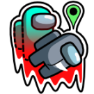

[:arrow_backward: back to overview](https://github.com/laicosvk/theepicroles "Back to all roles")

# Phaser (Impostor)
Mark - Teleport - Kill

The Phaser has the ability to mark a person after a certain amount of time. After a specified time the Phaser can phase through reality, teleport to his marked person and kill it. This only works if the marked player isn't very close to another player.

## Notes
- The Phase button is disabled if the marked player is close to another player.
- Phaser and Camouflager exclude each others.

## Buttons
|Mark Button|Phase Button|
| :------------: | :------------: |
|||

## Options
|Name|Default|Description|
| :------------: | :------------: | :------------: |
|phaserMarkCooldown|20|Mark Cooldown
|phaserPhaseCooldown|10|Phase Cooldown after marking
